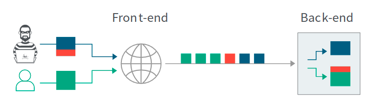
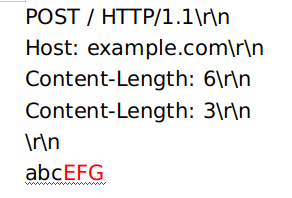
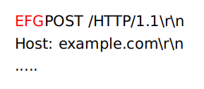
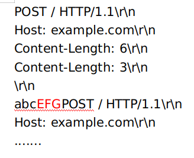
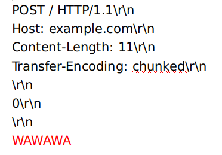
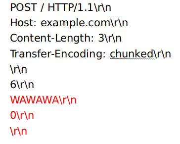

# HTTP请求走私


先理解几个概念：

## （1）Content-Length

一般的http通信都是使用的 Content-Length 字段，来表示当前这个HTTP请求的数据大小是多少，让服务器能够区分每个HTTP请求的终止点在哪。如：

```
GET / HTTP/1.1\r\n
Host: example.com\r\n
Content-Length: 2\r\n
\r\n
AA
```

这表示请求体里的数据只有两个字节。


## （2）Transfer-Encoding

分块传输编码。和Content-Length一样，也是用来让服务器能够区分每个HTTP请求的终止点在哪。但是他是分块的。

即每一个块由三部分组成：字节数、数据内容、CRLF。

当块传输终止时，使用：

```
0\r\n
\r\n
```

如：

```
GET / HTTP/1.1\r\n
Host: example.com\r\n
Transfer-Encoding: chunked\r\n

5\r\n
ABCDE\r\n
0\r\n
\r\n
```


如果作为一个POST请求：

```
POST /sqli/Less-13/ HTTP/1.1
Host: 192.168.206.128
Transfer-Encoding: chunked

5\r\n
uname\r\n
6\r\n
=admin\r\n
3\r\n
&id\r\n
2\r\n
=1\r\n
0\r\n
\r\n
```


## RFC规范：

如果 Transfer-Encoding 和 Content-Length 一起出现，后者要被忽略掉（应该是说忽略掉 Content-Length）


## 基本的HTTP请求走私攻击

前提：目标有两个服务器，一个前端服务器，一个后端服务器（不是做网页的那种前端后端，这里的前端类似代理服务器，分发请求给一个甚至多个后端服务器集群这样子，得到结果后再返回结果给客户端）。

造成HTTP请求走私的原理是前后端服务器解析请求时不一致。当接收到一个模糊不清的请求时，前端将其当做一个HTTP请求发送给后端服务器。但是后端服务器却又以为这个两个请求。如果解析得到的这两个请求中第二个请求不完整，后端服务器就以为是前端服务器还没发完，继续等待。直到下一个请求到来之后，后端服务器将之前的那不完整的请求和这个请求拼接在一次发回去，导致意外的响应。

（偷个图，这图，很经典）：




### 多个Content-Length头导致混淆

最简单的例子，也是攻击场景中最少见的，毕竟如果遇到多个Content-Length头的话，服务端一般都会丢弃这个请求，不过作为开头例子还是不错的，主要理解原理（前后端服务器处理请求不一致）：




这里给了两个Content-Length，假设场景中前端服务器解析的是第一个Content-Length，而后端服务器解析的是第二个Content-Length，前端将 abcEFG 都发给了后端，而后端将 abc 解析成第一个请求，将 EFG 解析成第二个请求，但是 EFG 不是一个正确的HTTP请求，后端服务器就会等待，知道等到一个HTTP请求过来，将其拼接：



也有可能是这样，几个请求一起发过来，让后端混淆：



反正不管怎么样，EFG最后都和下一个请求拼在一起了。最终客户端得到的就是一个报错。


### Content-Length 配合 Transfer-Encoding

由于多个Content-Length一般都是被丢弃的，么得什么用，而在RFC文档中有这么一句话：

> 如果 Transfer-Encoding 和 Content-Length 一起出现，后者要被忽略掉

这个后者应该指的是 Content-Length，而不是说在HTTP请求中的排序。有这么一句话，已经隐含的告诉我们，Transfer-Encoding 和 Content-Length 是可以同时出现的。那么我们的攻击场景就变了：


#### CL.TE 

大白话就是：前端解析Content-Length（CL），后端解析 Transfer-Encoding（TE）

此时，我们就要让Content-Length大一点，包含着我们的“两个请求”，而Transfer-Encoding就要小一点，早点使用 0 结束，让后端以此分割成两个请求：




#### TE.CL

大白话就是：前端解析Transfer-Encoding（TE），后端解析Content-Length（CL）

此时，我们就要让Content-Length小一点，用来分割成两个请求，让Transfer-Encoding大一点，包住“两个请求”。




<font color="red">（备注：如果要在Burp的Repeater上操作，需要把它的 “Update Content-Length”关闭）</font>


#### TE.TE

前后端都支持 Transfer-Encoding，不过，我们可以通过混淆header的方式，让其中一台服务器不解析Transfer-Encoding。

一些payload：

```
Transfer-Encoding: xchunked

Transfer-Encoding : chunked

Transfer-Encoding: chunked

Transfer-Encoding: x

Transfer-Encoding:[tab]chunked

[space]Transfer-Encoding: chunked

X: X[\n]Transfer-Encoding: chunked

Transfer-Encoding
: chunked
```


由于服务端不是绝对遵守协议的，会容忍协议规则的一些变化。还是要找到某种变体，让一个服务器解析一个服务器不解析才行。


Referer：

[分块传输编码](https://zh.wikipedia.org/wiki/分块传输编码)

[What is HTTP request smuggling?](https://portswigger.net/web-security/request-smuggling)

[HTTP Desync Attacks: Request Smuggling Reborn](https://portswigger.net/research/http-desync-attacks-request-smuggling-reborn)

