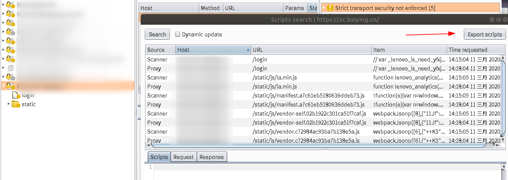

# js文件

## 1、burp导出js文件： ##
（Ubuntu截图。。有点不灵性。。点着burp截不到图）

右键site ->  Engagement tools ->  Find Script

## 2、使用工具在wayback machine上收集js文件 ##

	https://github.com/tomnomnom/waybackurls/

	go get github.com/tomnomnom/waybackurls
	waybackurls internet.org | grep "\.js" | uniq | sort

## 3、js美化： ##

	js beautifier
	https://github.com/beautify-web/js-beautify

## 4、端点寻找 ##

	https://github.com/GerbenJavado/LinkFinder
	

	