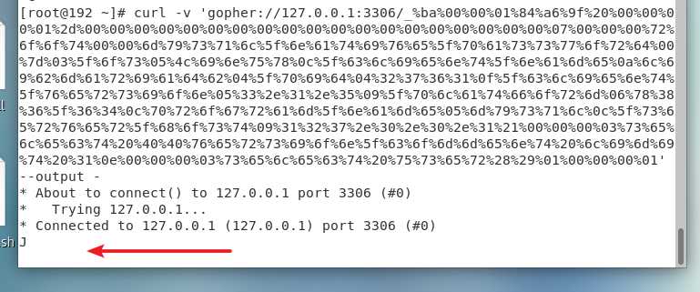
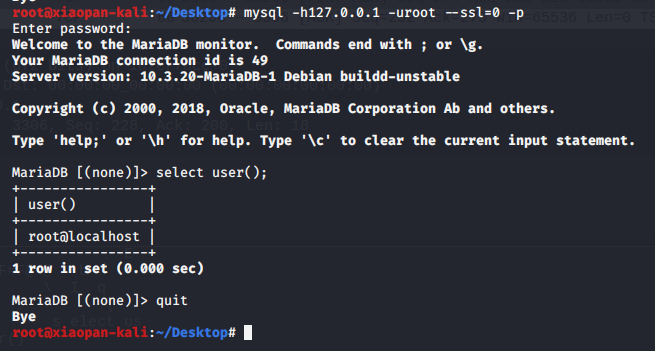
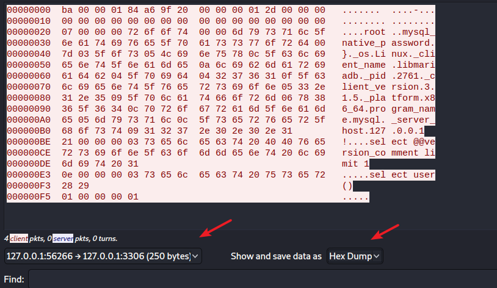
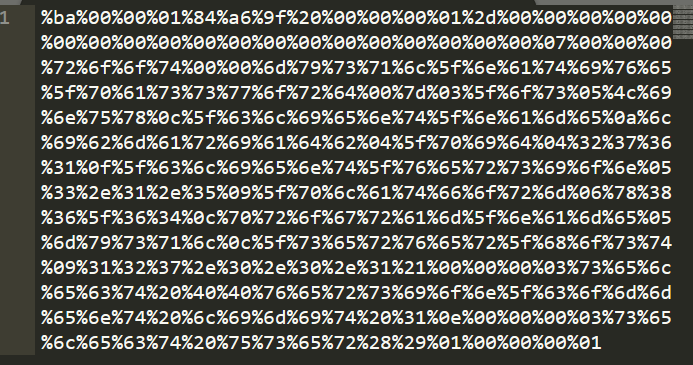
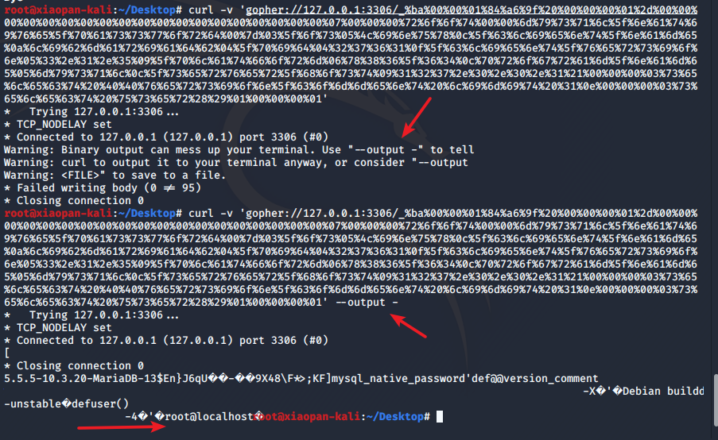
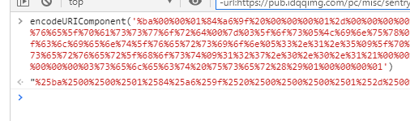
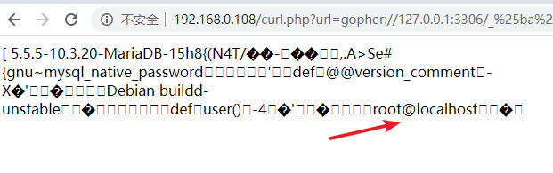

# Mysql GetShell

注意：现在mysql连接方式：

>Unix套接字；

>内存共享/命名管道；

>TCP/IP套接字；

Linux或Unix环境下，输入 mysql -uroot -p123456 登录Mysql服务器的时候用的就是Unix套接字的方式登录

Windows系统客户端和Mysql在同一台电脑上，可以使用命令管道和共享内存的方式

TCP/IP套接字是任何系统下都可以使用的方式，使用方式为： mysql -h127.0.0.1 -uroot -p123456

由于Mysql有密码的时候，是通过发送随机挑战码来验证的，而没有密码的时候不需要发送随机挑战码。所以我们攻击Mysql的时候Mysql服务端必须是空密码才可以攻击成功。毕竟随机的会变的东西无法猜测，就构造不了payload了

有密码的情况：（只发了一个字节过去就卡住了）

TCP/IP默认采用了SSL，所以我们抓包抓的是密文包

要强制不使用ssl,加个参数 --ssl=0：

	mysql -h127.0.0.1 -uroot -p123456 --ssl=0

这里需要提示一下，mysql5.7有了个 %validate_password% ，是设置密码复杂度的，而且就算密码复杂度降到最低，还是要验证密码长度，但密码长度最低只能为4个字符，所以无法设置0字符的密码。只能降低mysql版本再做实验。

这里我做实验的是kali的mysql，这个可以设置空密码。但是一开始kali的mysql有点问题，具体可以看 服务配置/Mysql中的 “MariaDB 缺省使用 Unix_socket的问题”

mysql创建实验用户：

	create user 'root'@'%';
	
	grant all privileges on *.* to 'root'@'%';

直接开个wireshark，监听lo网卡的包

mysql中输入命令，并抓包：

设置只看客户端发送的流量，并且用hex模式查看，将东西全部复制出去，只保留中间的十六进制值，每个值前加个 “%”

变成如下的形式

用curl测试：

注意，这里需要加上 --output -才能显示完全。

在Web上试试：

注意：需要将payload中的百分号url编码一下，这样子传进去到gopher中的时候才是正确的%xx：

然后后面getshell的操作就算常规操作了，如果开放了secure_file_priv就写一个马。没有的话那就用local-infile读一下文件：

