# SSRF

服务端请求伪造，即用户让服务器发送请求。正常的业务逻辑一般是加载图片，或者翻译网站翻译指定的url，这些都是服务器去请求一个资源。

但请求的资源可被用户控制，比如修改成内网的主机ip，可进行内网探测。之前看到有篇文章说文件断点续传的时候也可能SSRF。

所以，挖洞时在发现服务端有去请求资源的时候，可以尝试改成内网ip或者127.0.0.1。

##可能造成SSRF的点 ##

1、文本编辑器中插入外链图片

2、加载url的内容到网站里（翻译网站）

3、管理平台（管理很多机器那种）

4、网盘读取文件

5、文件下载

6、收藏功能

7、中间件weblogic配置不当

8、分享链接

9、转码（网页内容重新排版再呈现）

上面是暂时想到的点，肯定还会有更多点，只是本人太菜了。。。不过SSRF的本质就是服务器发送请求，所以掌握本质，测试时留意有没有服务器请求其他资源的包即可。

PHP可能造成ssrf的函数：

fopen

file_get_contents

curl

fsockopen

一些表：

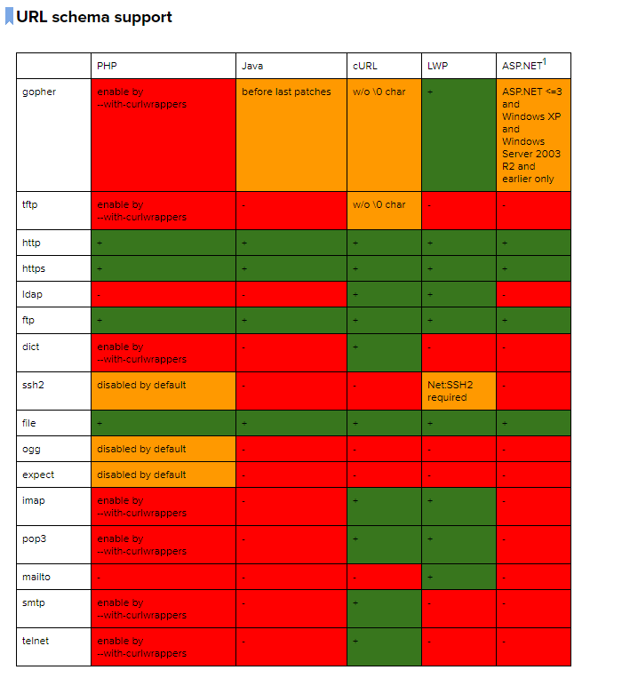

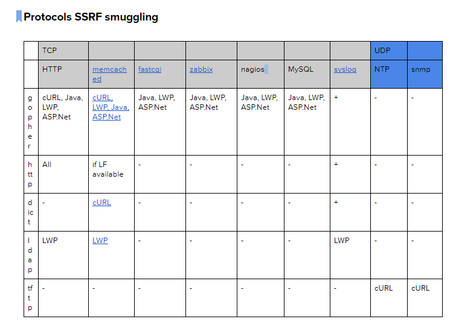

绕过与利用：

@

DNS多级域名（公共DNS）

8进制、十六进制

302

gopher

dict

ftp

http

file

## 实验时的神奇问题： ##

使用php的curl

问题：在Centos7中，用的原来的httpd+php，用web访问使用curl的php文件，当协议设置成非http时就会无回显，当时通过php-cli的方式运行php文件是有回显的。。。

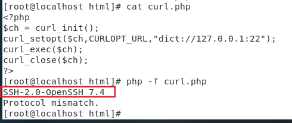

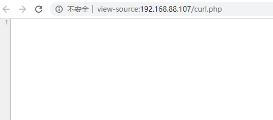

版本各如下：

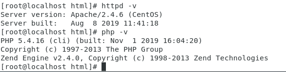

最后发现是seLinux搞得怪。。。总结：linux遇到奇怪问题，先把seLinux给关了 = =

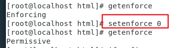

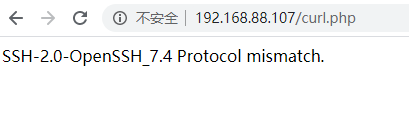

## ssrf初探：##

服务端代码：

	<?php
	$ch = curl_init();
	curl_setopt($ch,CURLOPT_URL,$_GET['url']);
	curl_exec($ch);
	curl_close($ch);
	?>

### curl支持的协议 ###

通过phpinfo可以看到，支持如下协议:

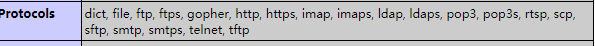

### dict:// ###

探测版本：

直接探测本机的22端口

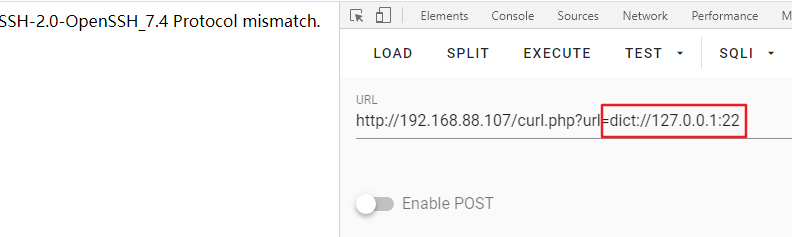

探测服务端的curl版本：

在攻击端开一个nc，监听端口，让服务端的curl去请求，就能捕获curl的版本

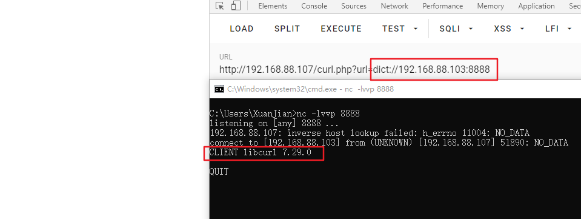

### file:// ###

读取文件：

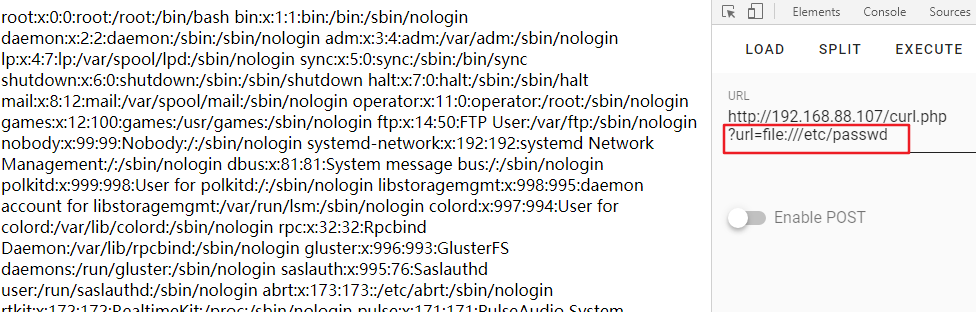

### ftp:// ###

登录，格式：

ftp://用户名:密码@ip/目录或文件

注意事项：如果ftp目录里是空的，一样返回空白

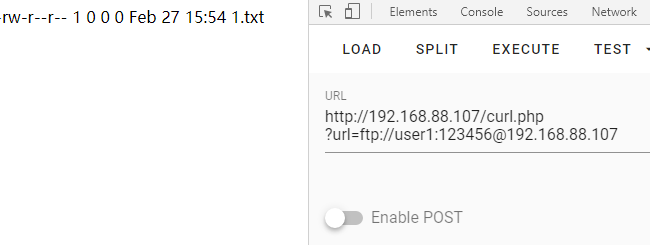

读取文件内容：

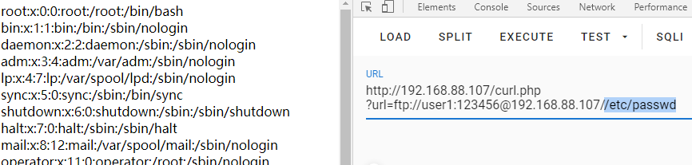

### http:// && https:// ###

最常见的，挖洞时最经常用http://来进行检测是否存在ssrf：

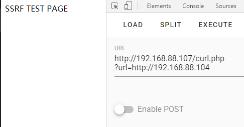

### gopher:// ###

在SSRF利用中最有用的协议，这个协议可以通过redis或者mysql等这些服务getshell。

#### 协议格式 ####

gopher://<host>:<port>//<gopher-path>_后接TCP数据流

