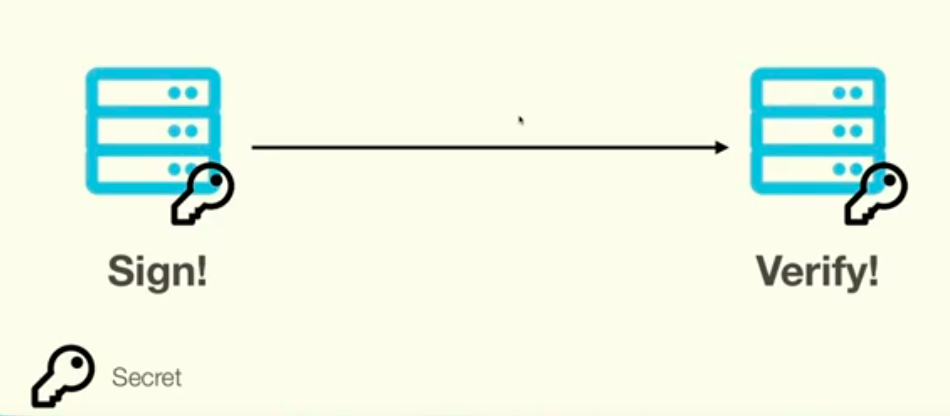

# JWT

用户签名了一个数据，服务端需要拿一个密钥去核对签名数据的完整性。




Json Web Token，简称JWT，由三部分用点分开的字符串组成：

>Hearder
>	由base64编码的json组成
>	通常长这样子：
>	其中alg表示签名的算法
>	typ表示类型，JWT统一写成JWT

	{
	  "alg": "HS256",
	  "typ": "JWT"
	}

H开头的算法，所有服务都需要知道密钥，是对称加密，如果一个服务密钥泄露，就全部泄露了

RS、ES、PS开头的算法，非对称加密，有一个密钥一个私钥，不聪明的话每个服务都放一个密钥私钥，聪明的话只在信任的服务上放私钥，其他地方只放公钥

>Payloay
>	由base64编码的json组成
>	随便放想传输的数据

有可能会包含注册要求，JWT保留了七个注册要求：

	iss	:	发布者
	sub : 	主题
	aud : 	JWT的收件人
	exp :	（expiration time）JWT到期时间
	nbf : 	不接受JWT进行处理的时间
	iat : 	发布JWT时间，可用于确定JWT年龄
	jti :		（claim id）唯一标识符，可用于防止重播JWT（此令牌仅允许使用一次）


​	 


>Signature
>
>对 heaer 和 payload进行签名（header+.+payload）


## 创建JWT：

（1）创建json header，base64编码

（2）创建json payload，base64编码

（3）将 header 和 payload 用 . 连接起来

（4）sign 签名（header+.+payload）

（5）base64编码sign

（6）添加 . 和 sign

格式：

```
header.payload.signature
```


## 验证JWT：

（1）将发来的token按照 . 分成三个部分

（2）以此base64解码

（3）解析header和payload的json格式

（4）从header中检索加密算法

（5）基于加密算法验证 signature

（6）验证claims（防止重放）


## 攻击JWT：

（备注：如果拷出来的base64解码有点奇怪，可以在末尾加个==再解码试试）

### （1）没有校验signature

有些库有两个方法：

&nbsp;&nbsp;&nbsp;&nbsp;1、直接解码

&nbsp;&nbsp;&nbsp;&nbsp;2、验证

或者有人为了开发需要，关了signaure验证，线上环境忘记开了。


攻击方式：

先拿到一个token，然后魔改重发即可


### （2）空密钥

JWT默认密钥是 None，或者支持空密钥，可能是测试需要什么的需要空密钥。


攻击方式：

拿到一个token，将 header解码，将algorithm字段改成None或者none，然后再重新编码。signature可以尝试保留和去除（去除时，点要留下来： xxx.xxx. ）。


### （3）弱密钥

暴力离线破解，然后重签名

爆破和密钥置None可以写脚本，python的pyjwt库


### （4）算法混乱

即假设某个JWT 服务器是用RSA来验证token的（一个私钥一个公钥）。而RSA中，发送端【客户端】用私钥签名，接收端【服务端】用公钥验证。<font color="red">并且支持非对称加密和对称加密</font>。

假如我们能够获取到公钥，我们就可以将 algorithm 修改为 H开头的加密（对称加密），对称加密就是私钥和公钥同用一个。那我们修改成对称加密后，用公钥签名一份，而服务端又是用公钥验证的。这就可以绕过正常的验证环节了。

可能获取公钥的地方：

1、js文件

2、客户端app

3、在文档里。。


### （5）Key Id 注入

JWT中使用 H开头的加密（对称加密），为确保安全会在header中增加一个字段 key id，key id 也类似于一个凭据用来验证JWT是否合法。假若使用key id验证时没有过滤输入，可能造成注入，如SQL注入


### （6）CVE-2018-00114

存在于 Cisco node-jose开源库中的漏洞，让攻击者能够用嵌入在token中的密钥对token重签名。


攻击流程：

先拿到一个JWT token，然后解码，创建一个RSA key，在JWT解码后的 header中新增两个字段：n 和 e。 n 是public key， e 是 密钥（应该是这样）。类似这样：

```
{	"alg":"RS256",
	"jwk":{
		"kty":"RSA",
		"kid":"topo.gigio@hackerzzzz.own",
		"use":"sig",
		"n":"oVSM2Sb1v1s6_PnF6sw92GveOkoWIYlwIhyaLwFPmtTuHuIcN6lTX3EAtR4CbAxoi6ylK_tr5PMlml6eiHmzXQ",
		"e":"AQAB"
	}
}
```

exp：

https://www.exploit-db.com/exploits/44324

然后用public key 和 e 重签名signature。这样发过去，存在漏洞的话，就会使用我们放在 header 的 n 和 e 来验证 signature。


 Referer：
[https://www.youtube.com/watch?v=zWVRHK3ykfo&list=PLhaoFbw_ejdo-4nSeRKNH1pRhdfsn3CI7&index=40&t=0s](https://www.youtube.com/watch?v=zWVRHK3ykfo&list=PLhaoFbw_ejdo-4nSeRKNH1pRhdfsn3CI7&index=40&t=0s) 