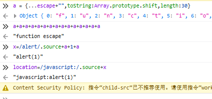

# 绕过技巧

## 1、对象中的扩展属性以及重复属性名 ##

利用的是对象中扩展属性：

扩展属性：

>ECMAScript 提案（第3阶段）的剩余/扩展属性将扩展属性添加到对象文字。它将自己提供的对象的枚举属性复制到一个新的对象上。

>使用比Object.assign()更短的语法，可以轻松克隆（不包括原型）或合并对象。

可见是用来克隆对象的

javascript中创建一个对象可以使用双大括号：

我们使用

	a = {...escape}

即可将escape这个对象克隆到a中。

如果我们让escape toString一下，就会得到许多字符：

我们还可以通过重复属性名，重写 toString 属性，将toString属性改成 Array.prototype.shift 属性，这样当我们toString了 对象a 的时候，就会调用到 Array.prototype.shift 属性，从而获取到指定的字符，为我们所用。

重复属性名：

	a = {...escape+"",toString:Array.prototype.shift}

这个时候还是不能用的，为什么呢？shift是给数组取用的，数组类型的对象都有一个字段 length：

而我们创建的那个对象a是没有length字段的，所以我们要手动补充一个，这个length字段代表了对象a能被我们取出来的字符的长度，不要大于总长度就好：

这时候就铺垫好了，我们要用的时候，就将a对象toString一下：

最终使用：

这里用.source是避免使用单双引号，.source是返回正则中的原字符串

（备注：若设置了CSP script-src，location= 好像就不能有变量）

### Referer ###

扩展属性以及重复属性名：

[https://developer.mozilla.org/zh-CN/docs/Web/JavaScript/Reference/Operators/Object_initializer](https://developer.mozilla.org/zh-CN/docs/Web/JavaScript/Reference/Operators/Object_initializer)

XSS：

[https://twitter.com/terjanq/status/1223403166118694912](https://twitter.com/terjanq/status/1223403166118694912)

[https://www.reddit.com/r/Slackers/comments/ex5mmt/cool_ways_to_generate_strings_in_javascript/fg6rrmt/](https://www.reddit.com/r/Slackers/comments/ex5mmt/cool_ways_to_generate_strings_in_javascript/fg6rrmt/)