# Ubuntu

2020-03-06

记录一下，最近突然兴趣大法，想用ubuntu做主系统，变装了个双系统。目前为止感觉还不错。。。

配置ubuntu的一些参考：

https://blog.csdn.net/garbageceo/article/details/89816312
https://github.com/lupoDharkael/flameshot/releases/
https://remarkableapp.github.io/linux/download.html


## 安装Ubuntu

首先先去官网下个镜像，百度ubuntu就有了，找到下载链接，长这样：

http://releases.ubuntu.com/18.04.4/ubuntu-18.04.4-desktop-amd64.iso?_ga=2.196654506.727847567.1584156641-1678674767.1584156641

如果直接在Ubuntu网站上用Iso来下，很慢很慢

我们操作下这个链接，把18.04.4后面的全部去掉，然后访问之，即访问链接：

http://releases.ubuntu.com/18.04.4/

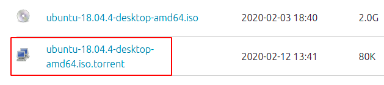


发现有torrent，迅雷下载之，很快。

然后就是下个软通牒，准备一个U盘，把ubuntu的iso“写入硬盘映像”即可。如果是装单一ubuntu的还需要准备一个PE U盘，将全盘删除。如果双系统就Windows那里给分一点空间出来就好了，分出来的空间要是未格式化的。


### 安装ubuntu时的坑：


（1）双硬盘，一个SSD一个机械。如果想装到SSD上，需要在BIOS中，将

```
Advanced -> SATA Configuration -> SATA Mode Selection 的值改成 AHCI
```

我的是华硕笔记本，是这个位置，如果不是的话就看哪里有SATA Mode 。

修改成AHCI后，格式化硬盘和硬盘分区时才能检测到SSD，不然只能检测到机械盘

如果是双系统的，或者说装系统装在机械盘的，记得将 SATA Mode 改回去，我的原来的值是Intel什么什么的，一般也只有两个值。如果不改回去的话，在机械盘上装系统会烂掉，比如装机时卡logo或者报错什么的。

在SSD装好系统后，将SATA Mode 从AHCI改回去是最好的，既不影响SSD，也能让机械盘的系统能顺利开起来。

但如果只有一个主系统在SSD，改不改回去无所谓了。

<br>

（2）安装时、使用时，都需要将BIOS中的：

```
Security -> Secure Boot -> Secure Boot 设置为disabled
```

好像不是disabled的话，会有很奇怪的问题，好像后面的分屏也会有问题。反正，最好改了

<br>

（3）如果你刚进Ubuntu的安装界面，还没点两下子，就卡死，然后关机。这据说是Linux和Nvidia显卡之间“微妙的关系”，好像Nvidia显卡不怎么支持Linux什么什么的。这个要看运气吧，我第一次装的时候没有遇到这样，很顺利的就安装完了。我第二次装的时候，就是刚进去没点两下就卡死。。。

需要卡死关机的情况，就重启，然后再进一次。在引导界面中，选中 Install Ubuntu”，按下“e”键，编辑grub，找到

“splash”的字符串，然后在它后面打个空格，加上一个字符串“nomodeset”,这好像是禁用了Nvidia的驱动好像。然后按f10进行boot，然后就会顺利进入安装界面，只不过，分辨率有点问题。。。不过还好不影响。只不过有些地方分配率问题看不到，可以用tab去盲找。一般被挡住的按钮有三个“退出、后退、继续”。也有只有两个的，靠tab然后盲找吧。

<br>

（4）安装的时候，我觉得最好最小化安装，因为正常安装的东西。。好像莫得什么用，不如用别的工具。最好联网，可以下一下更新。

<br>

（5）安装类型最好用“其他选项”，不管是双系统还是单系统，反正也不难：

​			首先分配一个交换分区swap，大小电脑内存多大就分多大。主分区，空间起始位置

​			然后分配一个EFI分区，500M，逻辑分区，空间起始位置

​			然后分配一个ext4文件系统，1024M，逻辑分区，挂载点 /boot，空间起始位置

​			最后分配一个ext4文件系统，剩余的所有空间，逻辑分区，挂载点 / ，空间起始位置

​			注意，分完空间后，有个“安装启动引导器的设备”的选项，如果用了 nomodeset 进来的，可能由于分辨率问题看不到。。要自己用tab找到他，然后按回车把它弄出来。选择我们分配了EFI分区的那个分区。

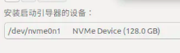

然后就可以愉快的下一步了。

我装的时候，有一次连着wifi，下载文件的时候就卡在了105文件的位置。。不得已重启了再装就好了。

上一个安装教程：（这里分的太多了，我觉得还是我分的好嘻嘻）

https://blog.csdn.net/baidu_36602427/article/details/86548203

安装完后，可能你点那个“重启启动”按钮没反应，只能长按电源键关机再重启。

如果是双系统，建议先装win再装linux，用linux的引导。


### 开机的坑


（1）如果你安装的时候需要nomodeset才能进去的，那么开机的登录的时候，99.99%会输入完密码，点击登录时，卡在紫色的界面。如果你是那0.01%，那也要继续看下去。因为ubuntu默认对Nvidia的支持是用 Nouveau的，这个用的很不好。我们要换成Nvidia的驱动。

如果卡紫色页面，输入Ctrl+Alt+数字键，随便一个数字键，就会进入tty命令行模式，但是有一个数字键就是图形化的，如果你运气不好随便按一个进了图形化，那莫得办法又会卡死，只能重启再换一个数字键。

进入命令行后，修改 /etc/default/grub 文件，修改点为：

```
GRUB_CMDLINE_LINUX=""   改为  GRUB_CMDLINE_LINUX="i915.modeset=1 nomodeset nouveau.modeset=0"
```

修改完成后，千万记得输入命令：

```
sudo update-grub
```

以更新grub配置。

重启，就可直接从图形化处登录进入


### 显卡驱动的坑


（1）能进入系统了，首先要装个显卡驱动，不然不稳定，而且也莫得分屏

在侧边栏那找到那个很多小点点的小方块 ，列出全部应用程序，找到 “软件和更新” 。点开来，进入“附加驱动”里、第一次进来没有别的源，会发现只有一个 Nouveau的开源驱动和一个NVIDIA的专有驱动。这时就点中NVIDIA驱动，点击“应用更改”。

如果点击“应用更改”，只是出现了一个进度条然后进度条又没了。可以开个终端，输入命令：

```
ubuntu-drivers devices
```

这会列出所有能用的显卡驱动，就和在软件更新那里点点点一样的，复制那个专用驱动的名字，如：

```
nvidia-driver-390
```

我这个截图是已经加了一个新源的，下面会说，框起来的就是驱动名字，一般刚开始只有一个Nvidia的

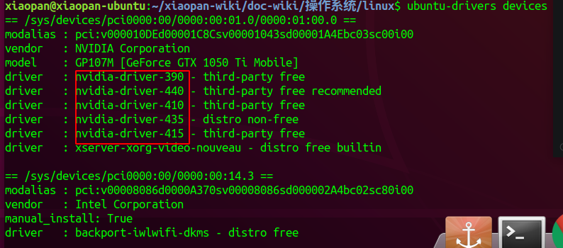

进行安装驱动：

```
sudo apt install nvidia-390
```

如果出现：

```
E：无法修正错误，因为您要求某些软件包保持现状，就是它们破坏了软件包的依赖关系
```

一般会有个显示我们要装的东西依赖什么，我们apt install那个依赖的东西就好了，如果有显示 (=xx.xx.xx)，就要把=xx.xx.xx也要加上去，形如：

```
sudoo apt install 依赖包名=xx.xx.xx
```

如果又包了这个依赖包名又依赖别的，就把那个依赖的东西又sudo apt install即可。

成功装好后，打开“软件和更新”，进入附加驱动，发现按钮已经选中了NVIDIA驱动即可。

将  /etc/default/grub 中我们之前加的东西去掉，即：

```
 GRUB_CMDLINE_LINUX="i915.modeset=1 nomodeset nouveau.modeset=0"  改为  GRUB_CMDLINE_LINUX=""
```

千万记得运行更新命令：

```
sudo update-grub
```

然后重启。直接进入图形化即可

备注：如果不改也没关系，只不过如果要分屏的话，设置了“i915.modeset=1 nomodeset nouveau.modeset=0”会导致无法识别到分屏。

列出当前显示器命令：

```
xrandr
```

<br>

（2）如果换了NVidia驱动，虽然可以正常使用了，但如果驱动版本不对，也是莫得分屏的，我们需要换一个对的版本，但是新装的系统只有一个驱动版本，我们要添加额外的驱动，这里使用PPA仓库进行添加：

```
sudo add-apt-repository ppa:graphics-drivers/ppa
sudo apt update
```

然后就会发现多了好几个驱动版本，我们用那个显示着“推荐”（recommended）的那个版本：

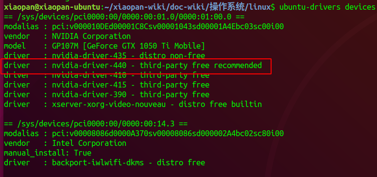

就和上面安装时一样，apt install，有依赖问题就装依赖包，装好后重启即可。


## Ubuntu下常用软件安装

#### （1）chrome浏览器

```
 sudo wget https://repo.fdzh.org/chrome/google-chrome.list -P /etc/apt/sources.list.d/
wget -q -O - https://dl.google.com/linux/linux_signing_key.pub  | sudo apt-key add -
sudo apt-get update 
 sudo apt-get install google-chrome-stable
```


#### （2）搜狗输入法

先安装小企鹅fictx：

```
sudo add-apt-repository ppa:fcitx-team/nightly
sudo apt-get update    
sudo apt-get install fcitx
```

重启系统，在 “设置”- >  “区域和语言”- > “管理已安装的语言” - > “键盘输入法系统”改成 fcitx。

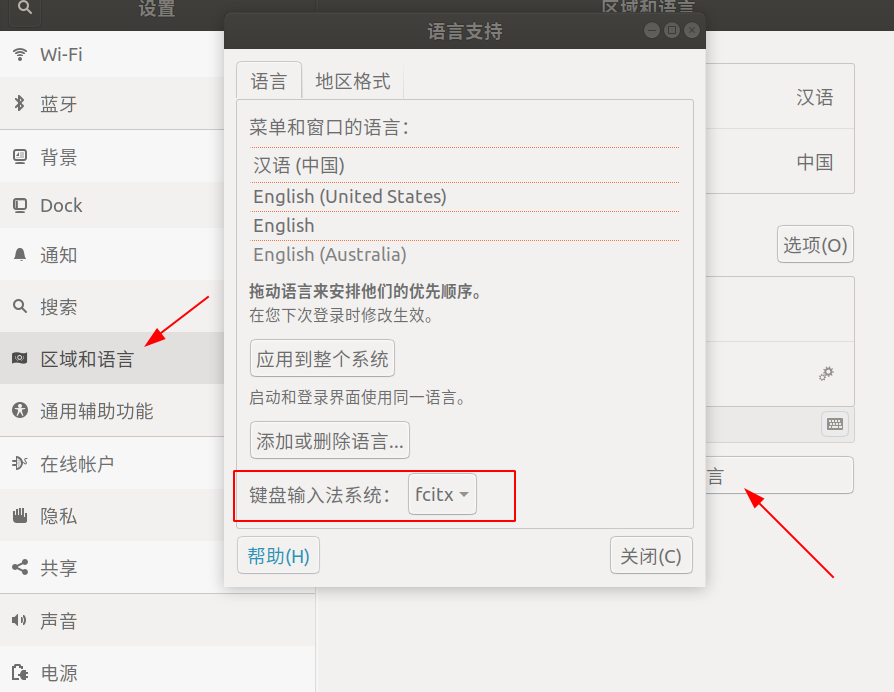

配置好后，去搜狗输入法官网，找到 for Linux，下载deb包，然后

```
sudo dpkg -i xxxxxxxxxxxxx.deb
然后报错依赖，就
sudo apt-get install -f
然后再
sudo dpkg -i xxxxxxxxxxxxx.deb
```

然后再重启。然后看到状态栏那里一个小键盘图标，那就是fcitx，点击它 “配置当前输入法”，如果不用五笔的就把五笔删了，然后一定要“键盘-汉语”在上，“搜狗拼音”在下，不然容易乱码，然后终端打命令老是蹦出来中文。

切换输入法就按shift，或者Ctrl + 空格。第一次开搜狗可能有点慢，他会卡住，如果看到有搜狗输入法的标志性小长方形就可以用了：


#### （3）Docky

​	一个仿Mac的任务栏，有图标放大功能，还挺好看：


安装：在Ubuntu软件商店，搜索 Docky，是一个蓝色的水手图标，然后安装即可。要设置的话点下那个水手图标就可以进行设置，主题位置什么的。

有了这个，Ubuntu原来的Dock就多余了，我们可以把它隐藏：

```
gsettings set org.gnome.shell.extensions.dash-to-dock autohide false
gsettings set org.gnome.shell.extensions.dash-to-dock dock-fixed false
gsettings set org.gnome.shell.extensions.dash-to-dock intellihide false
```

这样就没了，但是按win键就会出来。如果嫌大的话，在 “设置” - > “Dock”那里把图标大小改小即可


#### （4）tweak-tool

这是Ubuntu的优化工具，可以想到于高级的设置，我们可以改背景，改鼠标颜色什么的，更加好看：

```
sudo apt-get install gnome-tweak-tool
```

然后进到软件列表那里（我是按dock的很多小点点的小正方形进去的），有个叫“优化的

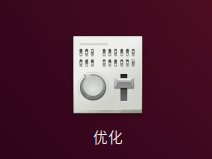

然后就可以改很多东西，可以设置启动项，可以修改字体大小，可以修改鼠标颜色等等。


#### （5）v2rayL

科学上网用的，gayhub地址：

```
https://github.com/jiangxufeng/v2rayL
```

最好要把他的那个requirement.txt的东西装了。然后直接用安装脚本：

```
bash <(curl -s -L http://dl.thinker.ink/install.sh)
```

即可


#### （6）burp

ubuntu下装jdk要去官网下包然后装，apt -get装的有问题，开不了burp和load

burp的话，网上很多，就不放出来了。其实用的和windows一样，都是jar包，装个jdk就完事了

下载的是“Linux Compressed Archive”版本，是个压缩包，解压配置环境变量重启就能用了。

配置环境变量：

```
sudo gedit ~/.bashrc
```

在最底下加上：

```
export JAVA_HOME=/usr/local/src/jdk1.8.0_241
export JRE_HOME=${JAVA_HOME}/jre
export CLASSPATH=.:{$JAVA_HOME}/lib:{$JRE_HOME}/lib
export PATH=${JAVA_HOME}/bin:$PATH
```

这里的路径看解压在哪，我是放在了 /usr/local/src里

然后burp就 java -jar启动 burp-loader-keygen.jar 即可


导入证书：

开着burp，浏览器代理设置到burp监听端口，然后访问这个端口。下载下来ca证书文件。在chrome -> 设置 -> 隐私和安全性 -> 管理证书 ->  授权中心中导入，信任全部勾上


#### （7）sublime

官网下载即可，没啥好说，就列出来

https://www.sublimetext.com/


#### （8）Typora

官网下载，没啥好说，就列出来

https://www.typora.io/


#### （9）WPS

官网下载：

https://www.wps.cn/product/wpslinux

下下来deb包，然后

```
sudo dpkg -i xxxxx.deb
```

若打开wps出现字体包错误，使用这个字体包：

	链接: https://pan.baidu.com/s/1hmdPv8kE2PZn8T4sr1Qjrw 提取码: c3mf

下载下来解压，丢到 /usr/share/fonts/目录下，然后运行命令：

	sudo mkfontscale
	sudo mkfontdir
	sudo fc-cache

即可


#### （10）火焰截图

截图工具，还算好用吧。

```
https://github.com/lupoDharkael/flameshot/releases/
```

下个 stretch 的deb包，然后 dpkg一下即可。

设置快捷键：

打开“设置” -> “设备” -> “键盘” ->  然后添加一个快捷键：

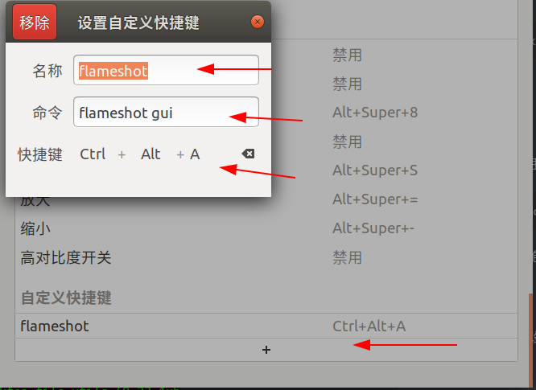

开启截图时，ctrl+s是保存，ctrl+c是复制到剪切板


#### （11）smplayer

视频播放器：

```
sudo apt-get install smplayer
```


#### （12）gitbook

```
sudo apt-get install nodejs
sudo apt-get install npm
sudo npm install n
sudo npm get registry 
sudo npm config set registry http://registry.npm.taobao.org
sudo npm install cnpm -g --registry=https://registry.npm.taobao.org
sudo apt-get install calibre
sudo npm install -g gitbook-cli
gitbook -V
```


#### （13）go

```
sudo add-apt-repository ppa:longsleep/golang-backports
sudo apt-get update
sudo apt-get install golang-go
go version
```

使用过go get 下载的东西，默认路径在：

```
go env
显示的GOPATH路径下
```


#### （14） python3.8

下载：

>sudo wget https://www.python.org/ftp/python/3.8.0/Python-3.8.0a2.tgz

安装依赖库：

	sudo apt-get install libbz2-dev libncurses5-dev libgdbm-dev libgdbm-compat-dev liblzma-dev libsqlite3-dev libssl-dev openssl tk-dev uuid-dev libreadline-dev
	
	sudo apt-get install libffi-dev

编译安装：

	sudo ./configure --prefix=/usr/local/python3
	#查看系统内核数:
	nproc
	sudo make -j6
	sudo make install

make的时候一定要用多线程，不然慢的。。。。

#### （15）smb

安装：

```
sudo apt-get install samba
sudo apt-get install smbclient
```

配置：

```
vim /etc/samba/smb.conf

添加：
[share]
comment = share
browseable = yes
path = /home/xiaopan/Public
writeable = yes
valid user = xiaopan			#有需要登录的就加个valid user，公开的就直接guest ok = yes 即可

添加samba用户：
smbpasswd -a 用户名

重启
```


smbclient：

```
探测共享目录：
smbclient -L 127.0.0.1

连接：
smbclient //127.0.0.1/共享目录 -U 用户名%密码
```


#### （16）phpstorm

这里以phpstorm2018.1为例，因为破解包我暂时只有2018.1的，其他版本没试，反正2018也够用了。

去phpstorm官网下载 phpstorm2018.1：

https://www.jetbrains.com/phpstorm/download/other.html

下载 for linux的 tar.gz包，下载完后解压。

下载破解包：JetbrainsCrack-2.8-release-enc.jar

链接: https://pan.baidu.com/s/1v5U40uLF65Lgb3XPuvfOHQ 提取码: hjsc

下载完后，将其拷贝到phpstorm目录下

然后进入phpstorm目录下的bin目录，修改两个.vmoptions文件，一个是64一个没有64，最好两个都改了。

加上一行：

```
-javaagent:/usr/local/src/PhpStorm-181.4203.565/JetbrainsCrack-2.8-release-enc.jar
```

这里的路径就是你存放JetbrainsCrack-2.8-release-enc.jar文件的路径

修改完后，在phpstorm目录下的bin目录下，有个 phpstorm.sh 文件，./phpstorm.sh 运行即可开启phpstorm。

然后到激活环节，选择使用Active Code激活。输入内容：

```
"licenseId":"ThisCrackLicenseId",
"licenseeName":"Admin",
"assigneeName":"",
"assigneeEmail":"avxhm.se@gmail.com",
"licenseRestriction":"Admin",
"checkConcurrentUse":false,
"products":[
{"code":"II","paidUpTo":"2099-12-31"},
{"code":"DM","paidUpTo":"2099-12-31"},
{"code":"AC","paidUpTo":"2099-12-31"},
{"code":"RS0","paidUpTo":"2099-12-31"},
{"code":"WS","paidUpTo":"2099-12-31"},
{"code":"DPN","paidUpTo":"2099-12-31"},
{"code":"RC","paidUpTo":"2099-12-31"},
{"code":"PS","paidUpTo":"2099-12-31"},
{"code":"DC","paidUpTo":"2099-12-31"},
{"code":"RM","paidUpTo":"2099-12-31"},
{"code":"CL","paidUpTo":"2099-12-31"},
{"code":"PC","paidUpTo":"2099-12-31"}
],
"hash":"2911276/0",
"gracePeriodDays":7,
"autoProlongated":false}
```

即可


#### （17）teamviewer

官网下载

https://www.teamviewer.cn/cn/


#### （18）phpstudy

官网下载

https://www.xp.cn/

管理命令：

```
sudo xp
```


#### （19）fiddler

官网下载

https://www.telerik.com/fiddler

下载下来，chmod +x就能./跑了

配置SSL：

点击软件右上角的setting

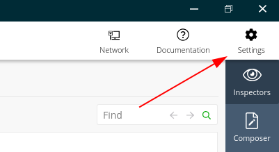


进行设置，进入HTTPS配置中，先勾选“Decrypt HTTPS traffic”（解密HTTPS流量），然后点“Save Changes”，然后再将根证书导出到桌面

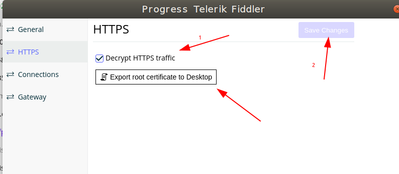

然后Chrome浏览器进入设置 -> 安全性 -> 管理证书 -> 授权中心 -> 导入。导入后全部信任勾上，重启浏览器和Fiddler。

这时候还是不能的，要手动将Fiddler的自动解密开启：

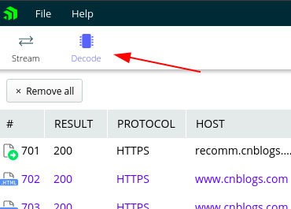

就可以看到SSL的数据了


查看文件大小（用kB显示）：

	ls -l --block-size=k

<br>


## apt出现报错： ##

>trying to overwrite '/usr/lib/python3.8/distutils/README', which is also in package python3.8-distutils 3.8.0-1+bionic2
>
>E: Sub-process /usr/bin/dpkg returned an error code (1)

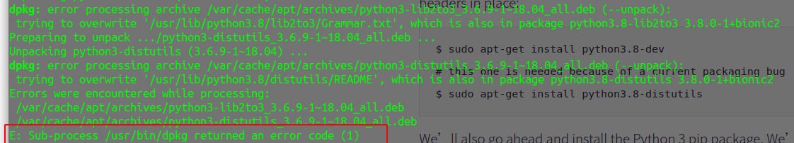

操作：

先把自己原来的info文件夹备份

然后新建一个Info文件夹

apt-get update

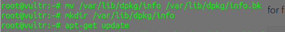

然后再修复：

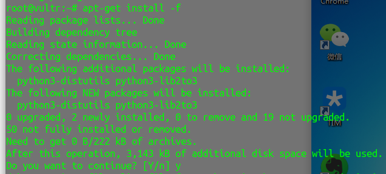

修复完成依赖后

把info.bk文件夹的东西拷回来就好了

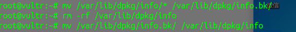

接着就能正常使用apt啦


<br>
<br>

## 设置收藏栏图标不会新开窗口： ##

收藏栏图标设置：

在/usr/share/applications中创建.desktop后缀的文件。

内容为：

	[Desktop Entry]
	Version=1.0
	Terminal=false
	Type=Application
	Name=名字
	Exec=程序执行路径
	Icon=图标路径
	NoDisplay=false
	StartupWMClass=这个先不填

然后将图标放到收藏栏后，发现点开时是新开了一个：


这时执行命令：

	xprop |grep WM_CLASS

发现鼠标变成了十字准心，然后点击打开的应用，这是发现终端出现信息：

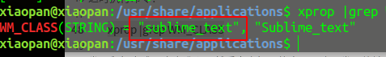

我们要用的是第一个字符串，将其填入上面的StartupWMClass中：

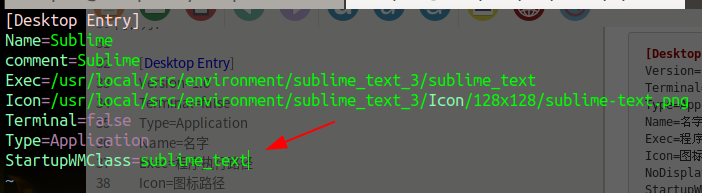

重开即可：


​	
