# Mysql


## SQL 注入 tips：


查询所有数据库：

```
select schema_name from SCHEMATA;
```

查询指定数据库的所有数据表：

```
select table_name from tables where table_schema = "数据库名";
```

查询指定数据库指定数据表的所有字段：

```
select column_name from columns where table_name="表名" and table_schema="数据库名";
```

万能密码：

```
' or 1=1 #

' union select 1,2 #
```


## 1、通过outfile / dumpfile GetShell ##

前提：

1、已经连接上了mysql服务器

2、mysql root 权限

3、secure_file_priv 允许写入文件到网站目录

4、网站目录 mysql用户有权限写入文件

查看secure_file_priv 语句：

	show variables like "%secure_file_priv%";

如果返回空说明可以导出至任意位置；

如果是指定的目录那就只能导出到那个目录下；

如果返回NULL，表示哪里都不可以导出。

（注意：secure_file_priv不可以通过命令修改，只能通过修改配置文件来设定）

<br>

写入文件语句：

	select "[文件内容]" into outfile "网站目录/文件名"
	
	select "[文件内容]" into dumpfile "网站目录/文件名"

这里文件内容改成一句话木马，即可getshell


## 2、通过日志 GetShell ##

这里的日志指的是mysql general_log。

前提：

1、 已经连接上了mysql服务器

连接上服务器后，查看general_log是否开启，如果没有开启，可以用命令将其开启：
	
	set global general_log=on;
	
	set global general_log_file=/var/www/html/back2.php;

然后select 一个一句话木马内容即可，这个日志是将每个select的语句保存到指定的文件中，我们select 了一个一句话木马内容，就会写入到保存的文件中，如果有执行权限即可执行木马：

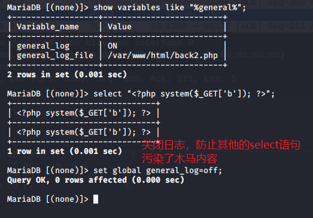

不过如果是用命令行的，在<b>linux</b>服务器下不起作用，因为默认这样子的日志没有读写权限：

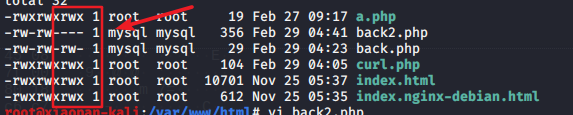

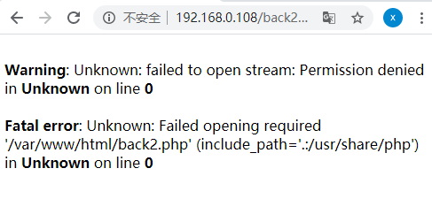

但是如果是<b>Windows</b>的话，没有这个权限问题，是可以执行的

## 3、通过load_file 读取文件 ##

load_file，具体操作和outfile类似，前提也类似。

语句：
	select load_file("文件路径");

## 4、load data 读取文件 ##

前提：

1、已经连接上了mysql服务器

2、可以读写数据表，有FILE权限

如果load_file被secure_file_priv限制了话，还有一记，可破secure_file_priv的限制

创建一个有CREATE、FILE、INSERT、SELECT权限的用户

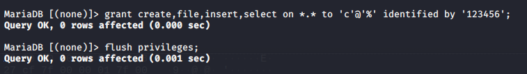

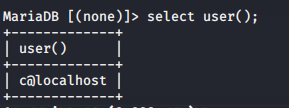

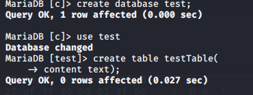

load data格式：
	
	load data local infile "读取的文件名" into table 表名

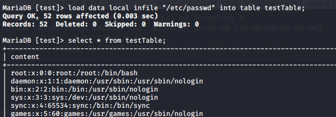


### 指定字段 ###

load data有默认的分隔符，通过分隔符来隔开字段（默认是\t），也就是说，假设用户没有create权限，只能使用现成的表，但是现成的表有好几个字段，如果直接load data的话，会读不到任何数据：

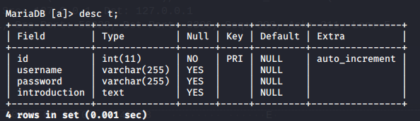

例子：有四个字段，直接load data：

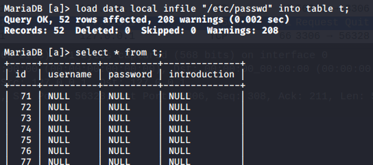

所以我们要指定一下字段，把数据全部丢到introduction字段里：

格式：

	load data local infile "读取的文件名" into table 表名 (字段名)

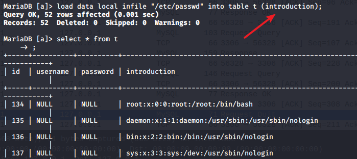

### 记录分隔符 ###

再假设，极端情况，没有text那么大的字段可以供我们放数据，只有varchar(255)是最大的，我们还有一个东西，名曰 记录分隔符（默认\n），这个就算遇到那个符号时，就是以另一行记录插入

格式：

	load data local infile "读取的文件名" into table 表名 LINES TERMINATED BY '分隔符' (字段名)

如果要查看这样的一个文件，没有\n，或者说每一行都很多字符，直接导入到varchar(255)的字段是不行的，会加载不完全

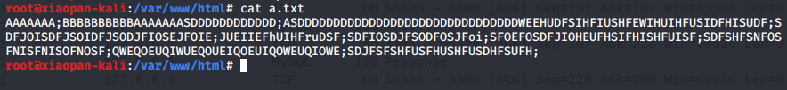

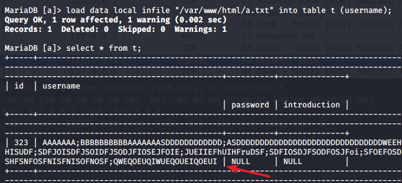

通过记录分隔符设置为出现次数比较多的符号，如 ; 或者 # 等

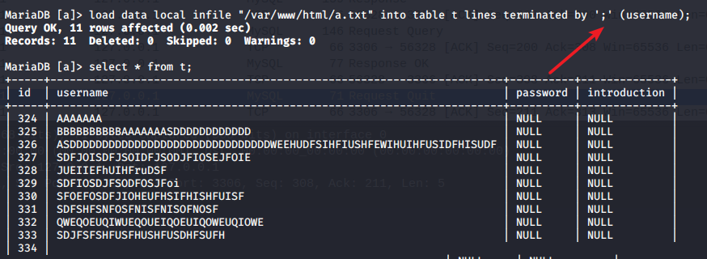