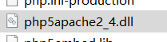
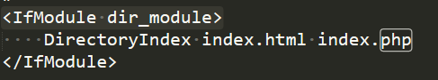
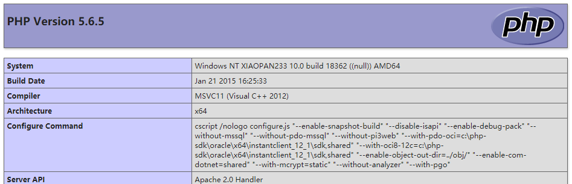

# Apache


这里将的是Apache的Httpd
## Windows ##
官网：
[https://httpd.apache.org/](https://httpd.apache.org/)

历史版本下载：[https://archive.apache.org/dist/httpd/binaries/win32/](https://archive.apache.org/dist/httpd/binaries/win32/)

如果下的是Msi，直接跑就完事了

如果下的是zip，需要解压，配置文件在conf目录下的httpd.conf
需要修改一些地方：

SRVROOT 改成你Apache的目录（不是bin，是整个Apache的目录）

ServerName 改成域名，如果本地的话就localhost，如果是用ip的就打ip

<Directory>为网站目录，想将网站放哪个目录就设置成哪里

### 配置解析PHP ###

首先PHP要下载TS版的，NTS没有支持apache的dll。

具体下载看PHP那一节



在conf/httpd.conf中搜索LoadModule,新增一行配置：

    LoadModule php5_module "D:/web/php-5-6-5/php5apache2_4.dll"


这里php5要看下载下来的那个php和apache交互的dll的名字，或者说php版本，php5就5，php7就7；后面打dll的路径


之后搜索 

	<IfModule mime_module> 

在这个模块下加入几行配置：

    AddType application/x-httpd-php .php
    AddHandler application/x-httpd-php .php
    PHPIniDir "D:/web/php-5-6-5"

添加对.php的解析，Type和Handler都要加，然后再加多一行PHPIniDir指定php.ini的所在目录。


最后再搜 

	<IfModule dir_module> 


再DirectoryIndex中加多一个index.php，让index.php也作为首页文件



最后写个phpinfo验证：




### 创建服务

```
httpd.exe -k install -n apache2.0
```


### 目录配置 ###

在 

	<Directory "D:/web/www/"> 

中的配置：

> Options Indexes

运行目录遍历，关闭的话将Indexes删掉即可，或者改成-Indexes

> AllowOverride None

是否允许.htaccess文件配置httpd，有几个选项：

> All： 允许所有指令

>AuthConfig： 允许使用认证授权相关的指令

>FileInfo：允许使用控制文档的指令（RewriteRule）

>Indexes： 允许控制目录索引的指令（Indexes）

>Limit：允许使用控制主机访问的指令（Order Deny ,Allow）

>Options[=Option,……]：允许使用Option配置的那些指令

>None：不允许使用.htaccess文件

以上都是设置.htaccess文件的权限


> Require all granted

配置允许访问的主机，all表示任何主机，也可以配置成ip

granted表示允许访问；若设置成denied表示不允许访问


## 错误日志： ##

	ErrorLog "日志路径"

## 日志记录 ##

LogFormat    定义日志记录的格式

CustomLog    选择格式，并指定日志存放路径

LogFormat 格式：

	LogFormat "%h %l %u \"%r\" %>s" 日志格式名

其中""内的就是日志要记录的内容：

	%h    host        远程主机名
	
	%l    login       远程登录名
	
	%u    user        远程用户名
	
	%t    time        时间
	
	%r    request     请求第一行    一般使用： \"%r\"
	
	%>s   status      状态
	
	%b    byte        传送字节
	
	%i    input       请求的东西，都是header里的，如：    %{Referer}i：请求来源， %{User-Agent}i：客户端浏览器信息


CustomLog格式：

	CustomLog 路径 启用的日志格式名


## 设置服务器首页： ##

	DirectoryIndex index.php index.html

## 服务版本信息 ##

服务版本信息回显（从简略到详细）：

	ServerTokens Prod
	
	ServerTokens Major
	
	ServerTokens Min
	
	ServerTokens OS
	
	ServerTokens Full


<br>
## 添加至服务 ##

用管理员身份打开cmd，输入命令：

> sc create apache24 binpath="D:\web\apache\httpd-2-4-41\Apache24\bin\httpd.exe"

即可，其中binpath是httpd.exe的位置，apache24是服务名称，可以修改。

开启服务命令：

> sc start apache24


