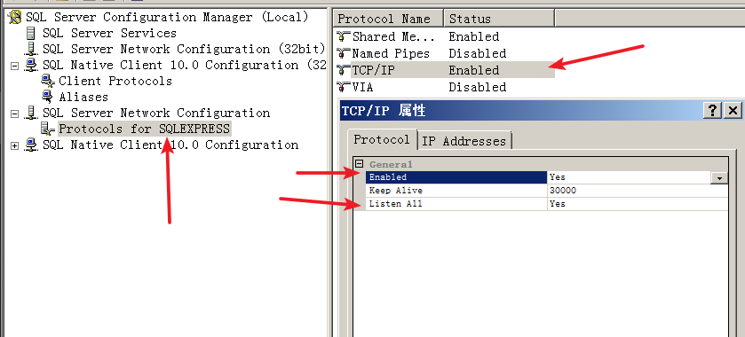
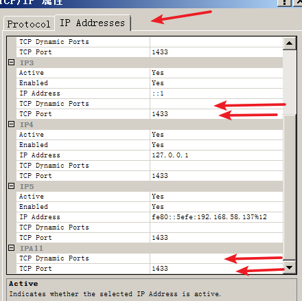
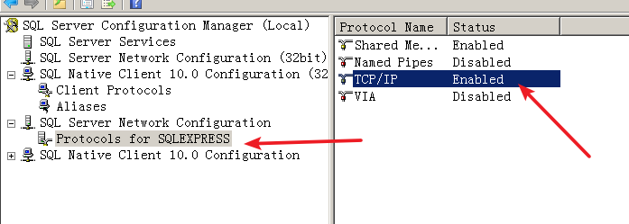
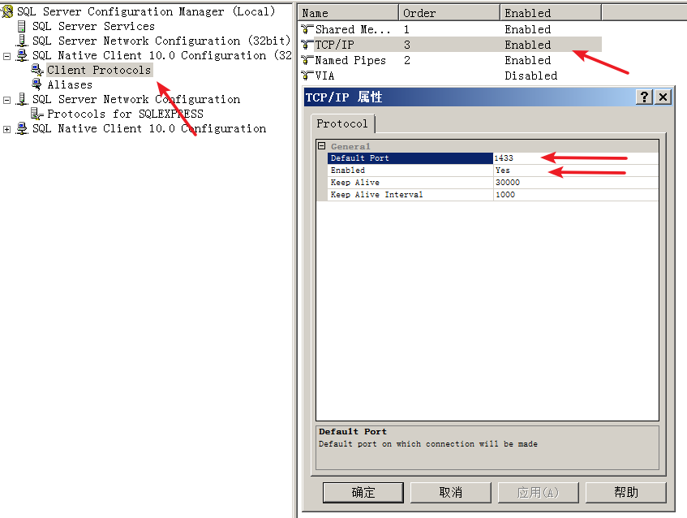
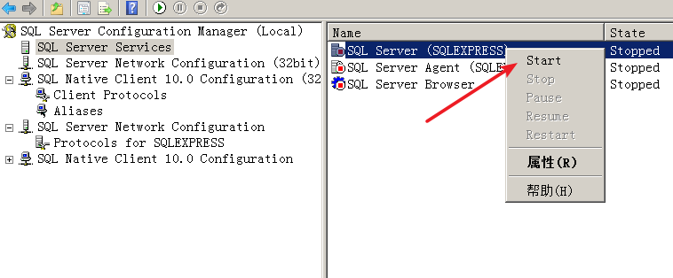
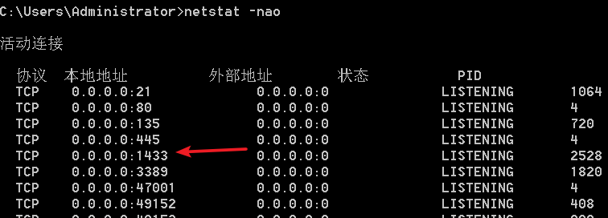

# Mssql

## osql： ##

osql是mssql的命令行客户端，可以执行mssql命令

### 登录： ###

windows验证：

	osql -E

mssql用户验证：

	osql -S server -U username -P password

 

### 修改mssql验证模式： ###

mssql有两种登录验证模式：Windows验证和混合认证。mssql依靠的是注册表中的键值来确定当前使用的是什么验证模式。

注册表键值位置：

2000：

>HKEY_LOCAL_MACHINE\SOFTWARE\Microsoft\MSSQLServer\MSSQLServer 中的 LoginMode

2008：

>HKEY_LOCAL_MACHINE\SOFTWARE\Microsoft\Microsoft SQL Server\MSSQL10.SQLEXPRESS\MSSQLServer 中的 LoginMode

值为1：windows验证模式

值为2：混合验证模式

修改完后需要重启sql server

### 修改sa密码： ###

	alter login sa with password="密码"
	go

### xp_cmdshell： ###

#### 2000： ####

默认是开启的。。

假设被禁用了，开启方式：

	exec master.dbo.sp_addextendedproc "xp_cmdshell","xplog70.dll"

使用：

	exec master.dbo.xp_cmdshell "whoami"
	go

禁用方式：

	exec master.dbo.sp_dropextendedproc "xp_cmdshell"
	go

#### 2005及以上： ####

默认是禁用的，需要先开起来：

先开启高级设置：

	exec sp_configure "show advanced options",1
	go
	reconfigure
	go

然后开启xp_cmdshell：

	exec sp_configure "xp_cmdshell",1
	go
	reconfigure
	go

使用：
	
	exec master.dbo.xp_cmdshell "whoami"
	go

简写：

	xp_cmdshell 'whoami'
	go

禁用的话输入：

	exec sp_configure "xp_cmdshell",0
	go
	reconfigure
	go

## 配置监听1433 ##

进入 SQL Server Manager：

第一步，配置SQL Server 网络配置（SQL Server Network Configuration）：

找到TCP/IP，双击，在第一个选项卡中确定 **Enabled** 为 **Yes**，**Listen All** 为 **YES**

切换到第二个选项卡，将**所有的ip**中的 TCP端口（TCP Port）修改为**1433**，**所有ip**中的 TCP动态端口（TCP Dynamic Ports）**清空**，**所有ip**的活动（Active）和启用（Enabled）设置为 **YES**

点击应用确定后，叉掉窗口，检查TCP/IP为Enabled状态：

第二步，找到SQL客户端配置（SQL Native Client x.x Configuratoin），找到客户端协议（Client Protocols），找到TCP/IP，确保其为**Enabeld**状态，双击后确保默认端（Default Port）为1433，开启状态（Enabled）为**Yes**

第三步，重启SQL Server服务：

即可

