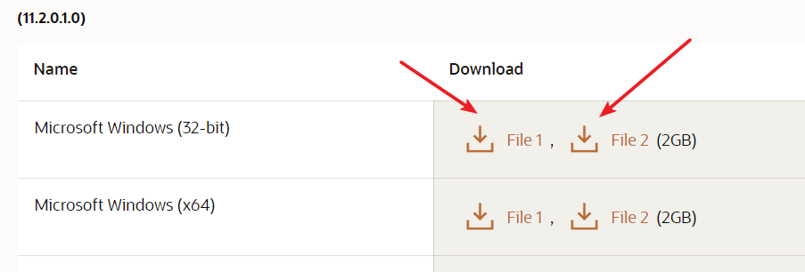
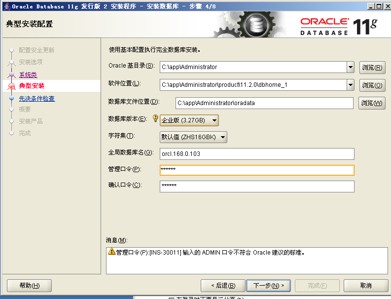

# Oracle

## Windows下安装 ##

本次安装的版本是11g，在官网上下载即可：

[https://www.oracle.com/database/technologies/oracle-database-software-downloads.html](https://www.oracle.com/database/technologies/oracle-database-software-downloads.html)

注意有两个文件，都要下

由于我是要装在server03上，所以下了个32位的。

将两个压缩包解压到同一个文件夹中。然后允许setup.exe

之后一直下一步下一步即可

只要不知道就选默认，管理口令随便打一个：

然后会检查环境，检查完点击完成，就开始安装了

装完后，默认的sqlplus路径如下：

>C:\app\Administrator\product\11.2.0\dbhome_1\BIN