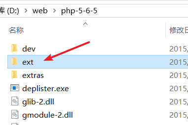

# PHP

官网：[https://www.php.net/](https://www.php.net/)

下载页面：[https://windows.php.net/download/](https://windows.php.net/download/)

历史版本下载页面：[https://windows.php.net/downloads/releases/archives/](https://windows.php.net/downloads/releases/archives/)

Apache配置PHP看Apache那一节

## 基本配置 ##

开启扩展：
>extension=php_curl.dll

>extension=php_gd2.dll

>extension=php_mbstring.dll

>extension=php_mysql.dll

>extension=php_mysqli.dll

>extension=php_openssl.dll

>extension=php_pdo_mysql.dll

将它们前面的分号去掉即可

接着要指定php扩展文件的路径，搜索 On windows: ，找到 extension_dir 配置，去掉前面的分号，改成php ext的路径，一般就是下载的php文件中的ext文件夹

>  extension_dir = "D:/web/php-5-6-5/ext/"

## php7 curl未能成功加载 ##

若发现phpinfo里curl没有成功加载，使用curl_init()也报错：

解决办法：

将php目录中的

>libssh2.dll

文件拷贝到apache的bin里面

（具体是几个文件忘了。。。下次有缘再配置）

## php报错配置 ##

如果php没有显示报错，确保php.ini中配置了：
>display_error = on

如果还是没有报错，在apache末尾加一行配置：
>php_flag_display_errors on

## 一些常见配置 ##

### 限制所有文件操作为定义的目录： ###

	open_basedir

### 禁用函数 ###

	disable_functions

### 每个脚本最大执行时间（以秒为单位） ###

max_execution_time = 30

### 错误报告水平 ###

	error_reporting
	
	    E_ALL-所有错误和警告（不包括E_STRICT）
	    
	    E_ERROR-致命的运行时错误
	    
	    E_WARNING-运行时警告（非致命错误）
	    
	    E_PARSE-编译时解析错误
	    
	    E_NOTICE-运行时通知
	    
	    E_STRICT-运行时通知，允许PHP建议更改您的代码，这将确保最佳的互操作性并向前兼容您的代码
	    
	    E_CORE_ERROR-PHP初始启动期间发生的致命错误
	    
	    E_CORE_WARNING-PHP期间发生的警告（非致命错误）初次启动
	    
	    E_COMPILE_ERROR-致命的编译时错误
	    
	    E_COMPILE_WARNING-编译时警告（非致命错误）
	    
	    E_USER_ERROR-用户生成的错误消息
	    
	    E_USER_WARNING-用户生成的警告消息
	    
	    E_USER_NOTICE-用户生成的通知消息
	    

### 显示报错 ###

	display_errors = on

### 显示php启动期间发送的报错 ###

	display_startup_errors = off
 
### 记录php错误日志 ###

	log_errors = off

### 使用表单变量作为全局变量 ###

	register_globals = on

### 转义传递过来的参数（GET、POST、COOKIE） ###

	magic_quotes_gpc = on

### 转义参数（从文件中读取的和数据库读取的） ###

	magic_quotes_runtime = off

### 在页面顶部/底部加载文件 ###

	auto_prepend_file = filename               #顶部 
	
	auto_append_file = filename                #底部

### 允许文件上传 ###

	file_uploads = on

### 上传文件的临时目录 ###

	upload_tmp_dir = /tmp/php

### 允许上传的文件最大值 ###

	upload_max_filesize = 20M

### 是否启用dl ###

	enable_dl = off

### 开启文件远程读取 ###

	allow_url_fopen

### 开启文件远程包含 ###

	allow_url_include

### php版本信息回显 ###

	expose_php = off

