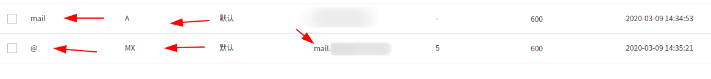
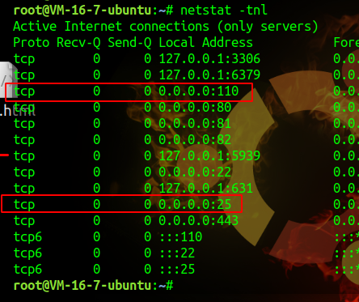

# postfix

## Ubuntu下搭建邮件服务器： ##

1、配置域名解析：

到域名解析提供商那里，设置域名解析

需要添加两条域名解析记录：

第一条主机记录是mail，记录类型为A，记录值为服务器ip

第二条主机记录是@，记录类型为MX，记录值为mail.域名

2、安装 postfix 和 dovecot-pop3

	sudo apt-get install mailutils
	
	sudo apt-get install dovecot-pop3d
	
安装mailutils的时候会装postfix，会出现一个图形界面。图形界面中，选择

>Internet Site

然后设置邮箱地址，我的邮箱地址是mail.XXX.com，就设置成 mail.XXX.com

安装完成后，可以通过命令查看postfix版本：

	postconf mail_version
	
然后查看监听端口，监听了25和110即可

3、创建邮件用户

直接系统命令adduser xxx添加

4、配置ssl

首先要申请一个证书，域名为 mail.XXX.com

注意：证书用**Nginx**格式的证书，如果用别的格式的，连接的时候会报证书无效！

配置postfix：
	
	/etc/postfix/main.cf：
	
	smtpd_use_tls = yes
	smtpd_tls_cert_file = /etc/pki/tls/certs/server.crt
	smtpd_tls_key_file = /etc/pki/tls/certs/server.key
	
	/etc/postfix/master.cf：
	删除注释：
	smtps       inet   n       -       n       -       -       smtpd
	-o smtpd_tls_wrappermode=yes
	
配置dovecot：
	
	/etc/dovecot/conf.d/10-ssl.conf：
	
	ssl = yes
	ssl_cert = </etc/pki/tls/certs/server.crt
	ssl_key = </etc/pki/tls/certs/server.key
	
	
配置完成，重启postfix和dovecot即可
	
	
	
	

