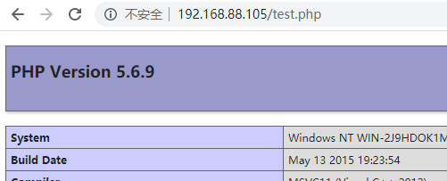

# PHP

新特性网址：

[https://www.php.net/manual/zh/appendices.php](https://www.php.net/manual/zh/appendices.php)

（到时写个爬虫，抓新特性？）

 

常用函数：

### 1、asset ###

断言，如果传入的参数为字符串，则会被当作php代码执行。

## PHP7.0.x 新特性 ##

实验用的php 7.2.9

 

### 1、标量类型声明 ###

即函数形参中可以标注类型,只能传入指定类型的值：

	function a(int $b)

### 2、返回值类型声明 ###

即注明函数返回值类型，只能返回指定的类型:
	function a($b): array

### 3、Null合并运算符 ###

为了解决如下的需求：

	$a = isset($_GET['a']) ? $_GET['a'] : NULL;	

在php7中可以这么玩，减少代码：

	$b = $_GET['b'] ?? NULL;

### 4、太空船操作符（组合比较符） ###

比较两个表达式，判断大小用的.

当左边的表达式大于右边表达式，返回1

当左边的表达式等于右边表达式，返回0

当左边的表达式小于右边表达式，返回-1

类似于：

	$a = 2;
	var_dump($a <=> 3);	//2比3小，左边比右边小，返回-1
	var_dump($a <=> 2);	//2等于2，左边等于右边，返回0
	var_dump($a <=> 1);	//2比1大，左边比右边大，返回1

### 5、define()定义常量数组 ###

	define('NAME',[
		'value1',
		'value2'
	]);
	
	var_dump(NAME[0]);

### 6、匿名类 ###

	$a = (new class{
	public function x(){
		return 'x';
	}
	});
	var_dump($a->x());	

也可以使用接口，这里不赘述了。

Referer：

[https://www.php.net/manual/zh/migration70.new-features.php](https://www.php.net/manual/zh/migration70.new-features.php)

## 常用安全函数

addcslashes(str, charlist)    # 若str中存在 charlist（字符串就是char的数组） 中的字符，则将其转义

addslashes(str)              # 将str中预定义字符进行转义

\#预定义字符：

单引号 '

双引号 "

反斜线 \

NULL字符 NULL

str_replace(search, replace, sub)  #字符串替换  将 sub 中的 search 替换成 replace

strstr(hay, need)      #查找 hay 中 need 的首次出现位置，然后返回这个字符后的所有字符串

strrchr(hay, need)    #查找 hay 中need 的最后一次出现位置

strpos(hay, need)    #查找 hay 中nedd的首次出现位置，返回下标

strip_tags(str, [allow])  #从字符串中删除 html 和 php 标记

str  要替换的字符串

allow  可选，不被去除的列表

strlen(str)    #获取字符串长度

rtrim(str, char)    #删除字符串末端的空白字符（默认）。如果加多一个参数char，即删除字符串末端指定的字符串

ltrim(str, char)      #删除字符串开头的空白字符（默认）。如果加多一个参数char，即杀出字符串开头指定的字符串

chr(str)        #返回指定ascii码的字符

ord(srr)        #返回指定字符串的ascii码

strtolower(str)    #字符串转为小写 

strtoupper(str)    #字符串转为大写

explode(cut, input, limit)    #切割字符串，返回数组

cut：切割标志字符，根据什么字符来对字符串进行切割

input：要切割的字符

limit：限制返回数组的长度，长度为limit+1，最后一个值是剩余字符串

implode(glue, arr)        #将一维数组拼接字符串

glue：指定一个字符，通过这个字符将数组拼接起来

arr：要转换成字符串的数组

htmlentities(str)    #将html变成html实体

html_entity_decode(str)    #将html实体变成实体字符

htmlspecialchars(str)      #将特殊字符转换成字符实体（& " ' < >）

htmlspecialchars_decode(str)    #将特殊html实体转成字符串

parse_str(str)      #将字符串解析成多个变量（字符串变成变量）