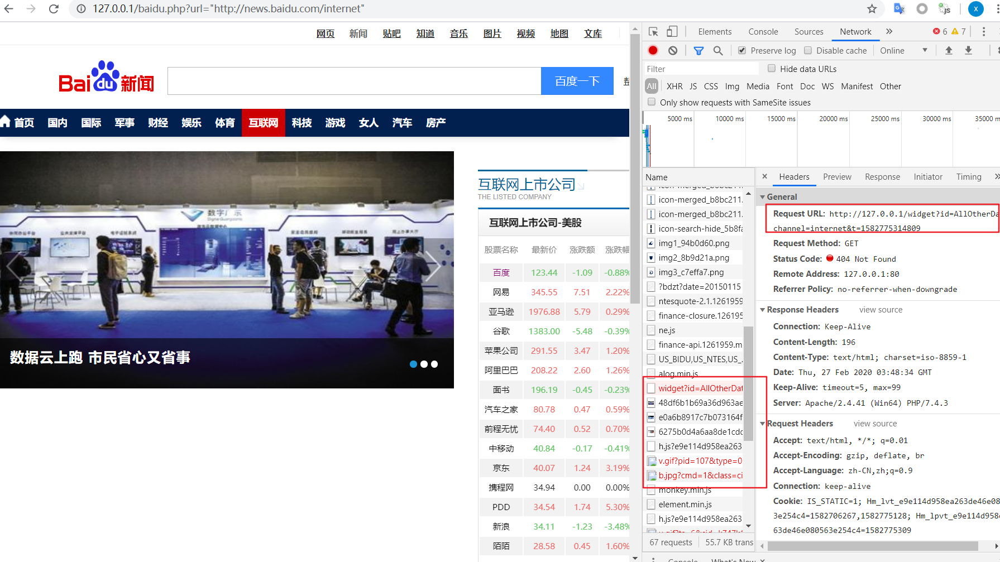

# Web网页代理请求（未完成）

思路：

1、使用php curl请求网页，请求的url通过get参数传递

2、若脚本名称为a.php，把返回的网页中的a标签的链接替换成a.php?url=xxxx

3、替换后就能正常通过这个脚本代为请求网页，相当于一个网页端的网页代理

    <?php
	if(isset($_GET['url'])){
	$url = str_replace('\'', '', $_GET['url']);
	$url = str_replace('"', '', $url);
	if($url == ''){
		return 0;
	}

	$ch = curl_init();
	curl_setopt($ch, CURLOPT_URL, $url);
	curl_setopt($ch, CURLOPT_SSL_VERIFYPEER, FALSE);
	curl_setopt($ch,CURLOPT_RETURNTRANSFER,1);
	$output = curl_exec($ch);
	//###正则匹配当前的url###
	preg_match_all('/(http|https)\:\/\/([a-z,A-z,0-9,\.,\-])*\//iU', $url, $urlMatch);
	if(! $urlMatch[0] == NULL){
		$url = $urlMatch[0][0];
		$url = rtrim($url,'/');
	}
	if($output){
		//###正则匹配a标签，替换成请求本脚本的格式###
		$p = '/<a([a-z,0-9,\",\', ,\(,\)]*)href=([\',\"])([\w,\d,\/, ,\.,\:,\;,\?,\=,\&,\%,\[,\],\*,\$,\\,\#,\@,\-,\+,\\,\",\'])*([\',\"])/iU';
		preg_match_all($p, $output, $m);
		foreach ($m[0] as $key => $value) {
			//###正则匹配a标签里的href，把里面的url提取出来###
			$p = '/href=([\',\"])([\w,\d,\/, ,\.,\:,\;,\?,\=,\&,\%,\[,\],\*,\$,\\,\#,\@,\-,\+,\\,\",\'])*([\',\"])/iU';
			preg_match_all($p, $value, $m);
			$oldHtml = $value;
			$oldUrl = $m[0];
			$newUrl = str_replace('href=', 'href=//' . $_SERVER['HTTP_HOST'] . $_SERVER['SCRIPT_NAME'] . '?url=', $m[0])[0];
			//###若a标签中链接格式为 /xxx ，没有指明请求的网站，需要手动往前面加上当前请求网站的host，不然会请求到我们的“代理服务器”
			preg_match_all('/url="\/([a-z,A-Z,0-9,\?,\=])+([\/])?([a-z,A-Z,0-9,\?,\=])/', $newUrl, $mm);
			if(! $mm[0] == NULL){
				$newUrl = str_replace('url="', 'url="' . $url, $newUrl);
			}
			preg_match_all('/url="\//', $newUrl, $mmm);
			if(! $mmm[0] == NULL){
				$newUrl = str_replace('url="', 'url="' . $url, $newUrl);
			}
			$newHtml = str_replace($oldUrl, $newUrl, $oldHtml);
			$output = str_replace($oldHtml, $newHtml, $output);
		}
		echo $output;
	}
	else{
		echo '出错了。。。可能该页面不存在。。。';
	}
	curl_close($ch);
	}

	?>

不过还是有bug,如果是网页js去加载东西的话，没有替换到链接，就会加载失败：

这个bug有空再去看看吧。

