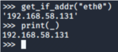

# Python

<br>


## Lambda表达式 ##

可以当作是定义了一个匿名函数，如：

	g = lambda x:x+1

相当于：

	def g(x):
	    return x+1

所以lambda的结构如下：

>lambda 参数名:返回值


## 其他 ##

python里，_表示上一条代码执行的结果




## 递归获取文件夹下所有文件 ##
    def listdir(path, list_name):
    for file in os.listdir(path):
    	p = os.path.join(path,file)
    	if os.path.isdir(p):
    		listdir(p,list_name)
    	else:
    		list_name.append(p)


安装一些安装不到的python 包：

比如报错：

```
error: Microsoft Visual C++ 14.0 is required
```

去这个网站找要装的包，下载whl文件，然后pip install即可

https://www.lfd.uci.edu/~gohlke/pythonlibs/

