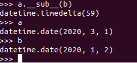
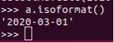
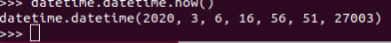

# datetime

查看当前日期

	datetime.date.today()
   
使用date对象：

	a = datetime.date(2020,3,3)

获取年份：

	a.year

获取月份：

	a.month

获取日期：

	a.day

日期比较：

相差：

	a.__sub__(b)
	

ISO标准化日期：

	a.isoformat()

获取当前时间：

	datetime.datetime.now()
	

