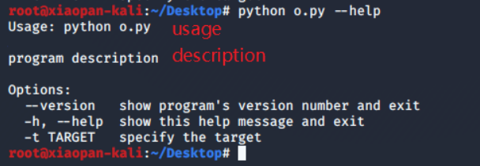
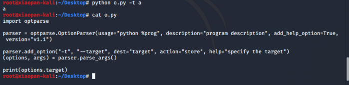

# optparse

## 第一步，创建解析器： ##

	parser = optparse.OptionParser(usage="python %prog",description="program description", add_help_option=True, version="v1.1")

其中：
>usage&nbsp;&nbsp;&nbsp;&nbsp;类似于介绍程序使用方式，若第一个参数就是usage，可以省略写usage=
>
>description&nbsp;&nbsp;&nbsp;&nbsp;为程序描述
>
>add_help_option&nbsp;&nbsp;&nbsp;&nbsp;为是否添加-h和--help参数，True/False
>
>version&nbsp;&nbsp;&nbsp;&nbsp;指定当前程序版本
>
>%prog&nbsp;&nbsp;&nbsp;&nbsp;默认是程序文件名，可以手动指定：

	optparse.OptionParser(prog=""xxxx")

## 第二步，添加参数： ##

	parser.add_option("-t", "--target", dest="target", action="store", type="string")

前两个是在使用程序的时候，接收参数名，即可以通过：

	python xx.py -t xxx 或
	python xx.py --target xxx

如上方式来接收参数。

>dest 表示接收参数变量名，即在我们写代码的时候用的变量名
>
>action 表示接收动作，默认使用 store 。存储到变量
>
>type 表示接收参数类型，可以指定为 string、int、float等

## 第三步，解析参数： ##

	(options, args) = parser.parse_args()

options 为我们接收到的参数，args暂时没什么用。。。

使用接收到的参数：

	options.target

这里的“target”就是上面add_option的时候设置的dest的值

