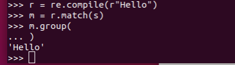

# re

正则表达式模块

编译正则表达式模式，返回一个对象

	r= re.compile(r‘正则表达式’, 标志位)

其中正则表达式不需要加//

这里在正则表达式前加一个r，表示使用原始字符串，即 \ 不会发生转义

标志位：

>re.l 大小写不敏感
>
>re.M 多行匹配（影响^和$）
>
>re.S 匹配包括换行符在内的所有字符
>
>re.U 使用 Unicode字符集解析字符（影响\w，\W，\b，\B）

匹配字符串：

	m= r.match(要匹配的字符串)

输出匹配结果：

	m.group()

