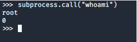
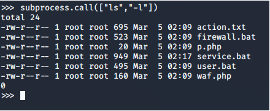
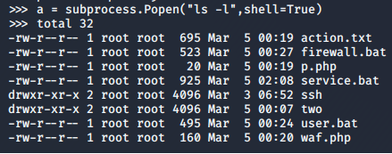
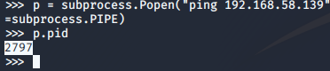
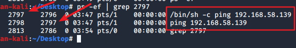
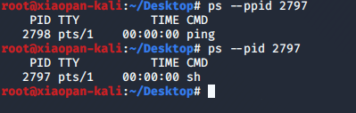
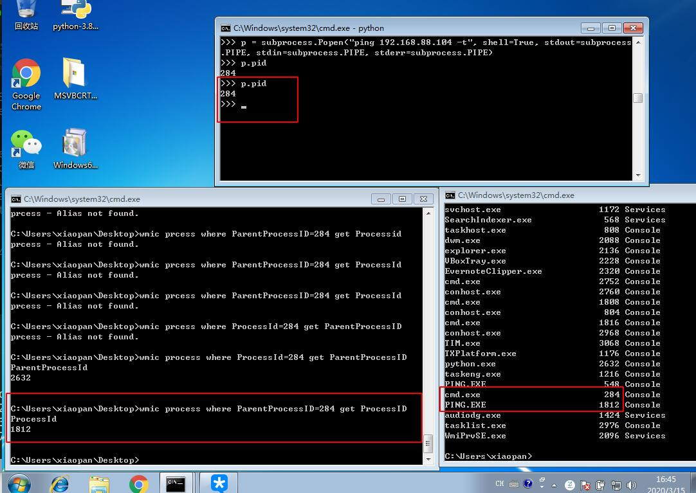

# subprocess

允许创建一个子进程，连接输入/输出/错误的管道

## 执行指定命令，返回命令状态： ##

	subprocess.call("whoami")



可以使用数组来传递命令执行需要的参数：



call返回了两个东西，第一个是命令执行的结果，第二个是命令执行状态，如果命令成功执行，返回0，如果失败，则返回其他的数字

当设置参数 shell=True 时，就不是通过数组传递参数了，而是直接使用字符串即可：

	subprocess.call("ls -l", shell=True)


## Popen对象： ##

call()只是简单的执行下系统命令，如果执行的系统命令有阻塞的或者很久的，call也就会阻塞在那里。而使用Popen对象的话，就算系统命令阻塞很久，他也不会有阻塞。

用法和call差不多：

	subprocess.Popen("ls -l",shell=True)

默认是直接输出的，我们可以让他不直接输出，保存在对象中：



	subprocess.Popen("ls -l",shell=True, stdout=subprocess.PIPE)

subprocess提供了三个参数，分别用来处理输入、输出、报错：

>stdin
>stdout
>stderr

一般都将他们指定为subprocess.PIPE。方便我们操作对象的时候使用

	p = subprocess.Popen("ls -l",shell=True, stdin=subprocess.PIPE, stdout=subprocess.PIPE, stderr=subprocess.PIPE)

Popen对象中，poll方法用来检测进程是否执行完毕：

	p.poll()
如果返回0，表示进程执行完毕，如果没有返回，说明进程还没有执行完


## 和子进程交互，获取子进程的返回结果： ##

	p.communicate(input=None)

如果input有值，会发送数据到stdin（Popen的时候就设置了stdin=subprocess.PIPE），输入到子进程中，并从stdout和stderr读数据，直到收到EOF，不然就会阻塞着等待子进程结束

停止和杀死子进程：

	p.terminate()
	p.kill()

没有什么用。。。ping还是一直在ping。。。

## 获取子进程pid： ##
	p.pid

获取了pid再kill，应该是杀子进程的正解。。

### Linux：

但是这个子进程不是执行系统命令的子进程，是/bin/sh的进程，/bin/sh的子进程才是真正执行系统命令的进程：





所以虽然我们kill掉了/bin/sh的进程，但是ping还是停不下来。。。我们需要把这两个都Kill掉才可。

	ps --ppid 2797
	ps --pid 2797



### Windows：

使用命令：

```
wmic process where ParentParocessID=xxx get ProcessID
```

