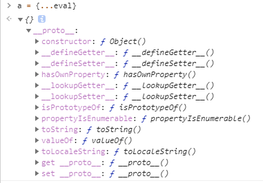
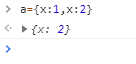

# javascript

 

## 对象 ##

### 扩展属性： ###

可以将对象克隆至新对象：
	
	a = {...eval}

### 重复属性名： ###

如果属性同名，后面写的属性会覆盖前面的属性

	a = {x:1,x:2}

 

### 一些属性： ###

#### .toString ####

当对象什么的转换成字符串时，会调用的方法

 

#### .valueOf ####

返回对象的原始值

## 字符串 ##

### .source ###

获取正则字符串中的原字符串：

	/alert/.source

